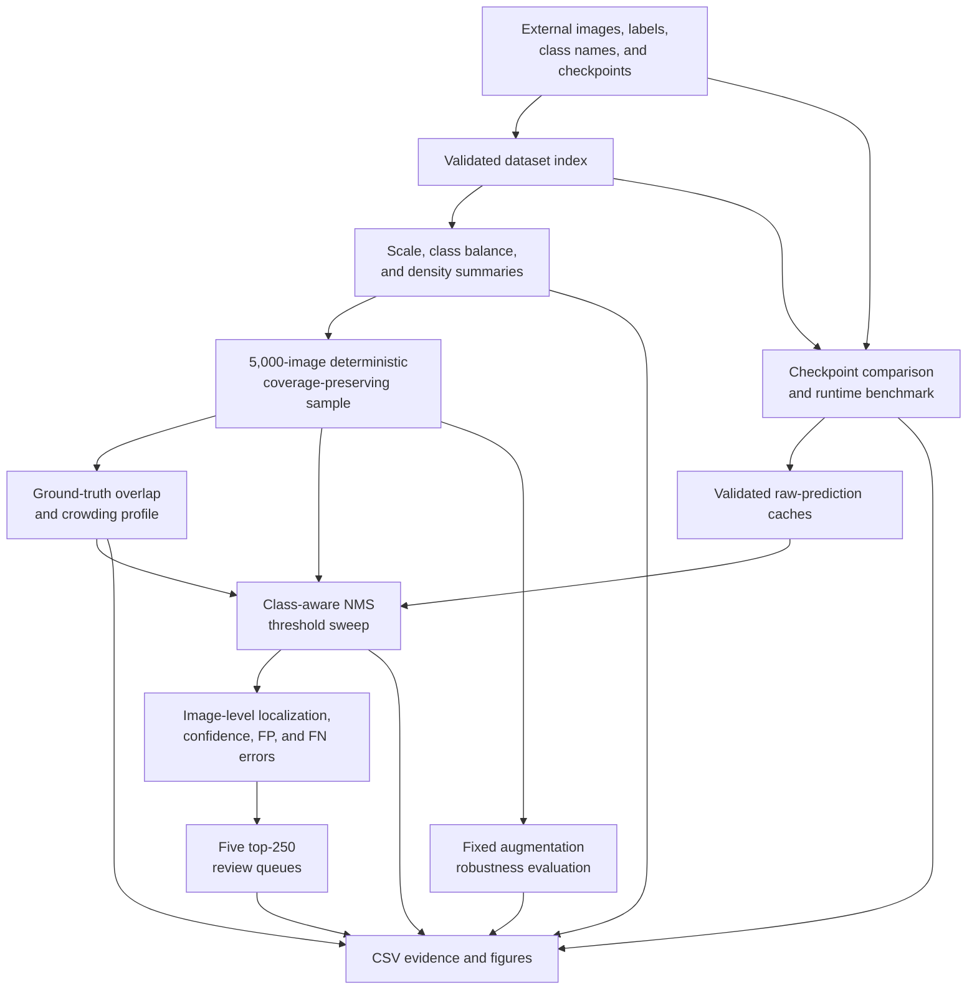

# Warehouse Object Detection

A reproducible computer-vision pipeline for detecting logistics objects in
video streams. The system accepts local video or UDP input; samples
frames; runs YOLOv4-tiny through OpenCV DNN; applies class-aware non-maximum
suppression; and emits structured detections with optional annotated JPEGs.

The repository also contains an evidence-oriented experiment suite for dataset
characterization, checkpoint comparison, operating-point selection,
augmentation robustness, and targeted error review.

## Capabilities

- Local-file and UDP video ingestion through OpenCV.
- Configurable frame sampling for bounded inference cost.
- Darknet `cfg`/`weights` inference with explicit candidate decoding.
- Combined-confidence filtering and deterministic, class-aware NMS.
- Human-readable frame and detection logs plus optional annotated output.
- One-to-one, same-class detection matching and 11-point interpolated mAP.
- Reusable raw-prediction caches that separate inference from post-processing.
- Deterministic dataset sampling with density and rare-class coverage controls.
- Controlled NMS and augmentation experiments with auditable CSV artifacts.
- Five specialized hard-example queues for focused detector review.
- A Python 3.12 Docker runtime with external, read-only model/data mounts.

## Runtime architecture

```mermaid
flowchart LR
    Source["Video source<br/>file | camera | UDP"]
    Sample["Frame sampler<br/>every Nth decoded frame"]
    Blob["OpenCV blob<br/>416 x 416 | RGB | 1/255"]
    Network["YOLOv4-tiny<br/>OpenCV DNN forward pass"]
    Decode["Candidate decoder<br/>pixel-space xywh"]
    Candidate["Objectness gate<br/>> 0.50"]
    Confidence["Combined confidence<br/>objectness x class probability"]
    NMS["Class-aware NMS<br/>confidence >= 0.50 | IoU 0.30"]
    Report["Structured console output"]
    Annotate["Class labels and boxes"]
    JPEG["Optional numbered JPEGs"]

    Source --> Sample --> Blob --> Network --> Decode --> Candidate
    Candidate --> Confidence --> NMS
    NMS --> Report
    NMS --> Annotate --> JPEG
```



The detector first gates raw candidates by objectness. NMS then ranks the
surviving boxes by `objectness * predicted-class probability` and suppresses
only higher-overlap boxes that predict the same class. Different classes are
never forced to compete for the same spatial region.

## Experiment architecture



Expensive network inference is cached before NMS. Thresholds, matching logic,
metrics, plots, and review priorities can therefore be recomputed without
rerunning the checkpoints.

## Repository layout

```text
detector_service/
├── app.py                         # Runtime orchestration and CLI
├── Dockerfile                     # Reproducible inference image
├── requirements.txt               # Exact runtime dependencies
└── modules/
    ├── inference/
    │   ├── preprocessing.py       # Video capture and frame sampling
    │   ├── model.py               # OpenCV-DNN model adapter
    │   └── nms.py                 # Combined-confidence, class-aware NMS
    ├── rectification/
    │   ├── augmentation.py        # Bounding-box-aware transforms
    │   └── hard_negative_mining.py # Image-level detector error components
    └── utils/
        └── metrics.py             # IoU, matching, precision/recall, mAP
experiments/scripts/               # Reproducible analysis entry points
tests/                             # Unit, integration, and packaging tests
requirements-analysis.txt          # Runtime plus analysis dependencies
```

Model checkpoints, dataset files, videos, generated outputs, and scratch data
are intentionally excluded from version control.

## Requirements

- Python 3.12
- FFmpeg for UDP smoke tests and stream simulation
- Docker Desktop or Docker Engine for container execution
- External YOLOv4-tiny checkpoints, class names, dataset, and test videos

OpenCV is pinned to `4.13.0.92`. OpenCV 5 removed the legacy Darknet importer
used for the supplied `cfg` and `weights` format, so upgrading OpenCV requires
first converting the checkpoints to a supported format such as ONNX.

## Setup

```bash
python3.12 -m venv .venv
source .venv/bin/activate
python -m pip install --upgrade pip
python -m pip install -r requirements-analysis.txt
```

Place or link the external assets at `detector_service/storage`:

```text
detector_service/storage/
├── logistics/
│   ├── *.jpg
│   └── *.txt
├── yolo_model_1/
│   ├── logistics.names
│   ├── yolov4-tiny-logistics_size_416_1.cfg
│   └── yolov4-tiny-logistics_size_416_1.weights
├── yolo_model_2/
│   ├── logistics.names
│   ├── yolov4-tiny-logistics_size_416_2.cfg
│   └── yolov4-tiny-logistics_size_416_2.weights
└── test_videos/test_videos/
    └── *.mp4
```

For an asset directory maintained outside the repository:

```bash
ln -s /absolute/path/to/storage detector_service/storage
```

## Run inference

The following bounded run processes five sampled frames and writes annotated
JPEGs under the ignored `scratch` directory:

```bash
python -m detector_service.app \
  --source detector_service/storage/test_videos/test_videos/worker-zone-detection.mp4 \
  --weights detector_service/storage/yolo_model_2/yolov4-tiny-logistics_size_416_2.weights \
  --config detector_service/storage/yolo_model_2/yolov4-tiny-logistics_size_416_2.cfg \
  --classes detector_service/storage/yolo_model_2/logistics.names \
  --frame-interval 60 \
  --candidate-threshold 0.50 \
  --confidence-threshold 0.50 \
  --nms-iou-threshold 0.30 \
  --max-frames 5 \
  --save-dir scratch/detections
```

Each sampled frame produces a `[FRAME]` record. Retained detections produce
`[DETECTION]` records containing the sampled-frame index, pixel-space box,
class ID, and combined confidence. Add `--no-save` for log-only execution.

### Receive a UDP stream

Start the detector first so that it is listening before the sender begins:

```bash
python -m detector_service.app \
  --source udp://127.0.0.1:23000 \
  --frame-interval 60 \
  --max-frames 3 \
  --no-save
```

Then publish a video from another terminal:

```bash
ffmpeg -nostdin -re \
  -i detector_service/storage/test_videos/test_videos/worker-zone-detection.mp4 \
  -an -r 30 -c:v mpeg4 -f mpegts \
  "udp://127.0.0.1:23000?pkt_size=1316"
```

## Run with Docker

Build from the repository root so the Dockerfile receives the expected context:

```bash
docker build \
  --file detector_service/Dockerfile \
  --tag warehouse-object-detection:local \
  .
```

The image contains code and runtime dependencies only. Mount assets at runtime
instead of embedding checkpoints or datasets in the image:

```bash
mkdir -p scratch/docker-output

docker run --rm \
  --mount type=bind,src="$(pwd)/detector_service/storage",dst=/app/detector_service/storage,readonly \
  --mount type=bind,src="$(pwd)/scratch/docker-output",dst=/app/output \
  warehouse-object-detection:local \
  python -m detector_service.app \
    --source /app/detector_service/storage/test_videos/test_videos/worker-zone-detection.mp4 \
    --max-frames 5 \
    --save-dir /app/output
```

## Reproduce the analysis

With the standard asset layout in place, run the scripts from the repository
root. Generated tables and figures are written below ignored
`experiments/outputs` and `experiments/figures` directories.

| Phase | Command | Purpose |
|---|---|---|
| Index | `python experiments/scripts/02_build_dataset_index.py --strict` | Validate image/label pairs and build three source tables. |
| Characterize | `python experiments/scripts/02_summarize_dataset.py` | Reconcile and summarize dataset scale, classes, and density. |
| Sample | `python experiments/scripts/02_dataset_sampling.py` | Compare three deterministic sampling policies and select one. |
| Overlap | `python experiments/scripts/02_overlap_analysis.py` | Measure ground-truth overlap and scene crowding. |
| Benchmark | `python experiments/scripts/01_benchmark_inference.py --sample-size 20 --repeats 2 --warmup-images 2` | Measure both checkpoints with stage-level timing. |
| Compare | `python experiments/scripts/01_model_comparison.py` | Compare both checkpoints with one evaluation policy. |
| NMS | `python experiments/scripts/03_nms_threshold_sweep.py` | Evaluate seven class-aware NMS thresholds. |
| Augmentation | `python experiments/scripts/04_augmentation_demo.py` | Render a deterministic augmentation example. |
| Robustness | `python experiments/scripts/04_augmentation_robustness.py` | Evaluate five fixed image conditions. |
| Error components | `python experiments/scripts/05_build_hnm_components.py` | Compute four bounded image-level error dimensions. |
| Review queues | `python experiments/scripts/05_build_error_review_queues.py` | Rank five specialized top-250 review queues. |

Use `--max-images` where supported for a bounded smoke run. Several analysis
CLIs provide combinations of three useful cache operations:

- `--refresh-postprocessing` reuses raw predictions but rebuilds NMS and metrics.
- `--force` rebuilds ground truth and raw inference caches.
- `--figures-only` redraws plots from existing derived tables.

Run any script with `--help` for its complete path and cache controls.

## Validated results

One complete run with the fixed checkpoints and evaluation policy produced the
following evidence. These are experiment-specific measurements, not claims of
general performance on unrelated warehouse environments.

| Area | Verified result |
|---|---|
| Dataset | 9,525 images, 36,721 labeled objects, and 20 classes. |
| Selected sample | 5,000 unique images and 19,196 labels with density and rare-class constraints satisfied. |
| NMS operating point | IoU `0.30` retained 7,727 predictions and produced 11-point mAP@0.5 of `0.401573`. |
| NMS tradeoff | Raising IoU from `0.30` to `0.70` increased retained predictions to 8,032 while mAP declined to `0.397159`. |
| Brightness shifts | Brighter and darker conditions changed mAP to `0.388012` and `0.379839`. |
| Stronger shifts | Gaussian blur produced `0.276908`; vertical flip produced `0.190519`. |
| Complete misses | 1,677 images had no retained prediction, covering 4,193 labeled objects. |
| Review queues | Five queues of 250 images; maximum off-diagonal Jaccard overlap was `0.259`. |

The nominal NMS choice is intentionally treated as provisional: mAP is nearly
flat from IoU `0.20` through `0.50`, while duplicate-like retained pairs rise at
more permissive thresholds. The selected value balances compact predictions
against equivalent measured accuracy under the fixed confidence policy.

## Evaluation semantics

- Predictions are matched to unused ground-truth boxes of the same class.
- A match requires IoU greater than or equal to `0.50`.
- Predictions are ranked by combined confidence.
- AP uses 11 evenly spaced recall levels.
- Aggregate mAP averages all 20 class AP values.
- The metric is therefore `11-point mAP@0.5`, not COCO-style mAP.

The augmentation experiment measures sensitivity to four controlled shifts; it
is not a complete robustness or safety evaluation. Hard-example queues are
review priorities, not automatically corrected training labels. The repository
evaluates existing checkpoints and does not include a model-training pipeline.

## Tests

```bash
python -m unittest discover -s tests -v
```

The test suite covers video-resource cleanup, decoding, confidence math,
class-aware suppression, one-to-one matching, augmentation geometry, cache
validation, deterministic sampling, experiment schemas, atomic artifact writes,
container packaging, and reference-compatible numerical behavior. The current
validated run passes 341 tests; one optional directory-symlink test is skipped
on Windows when the process lacks symlink privileges.
