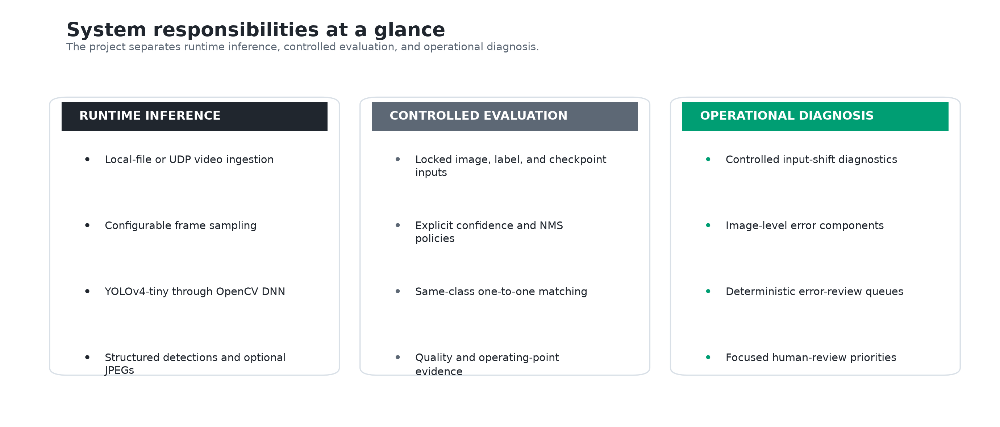
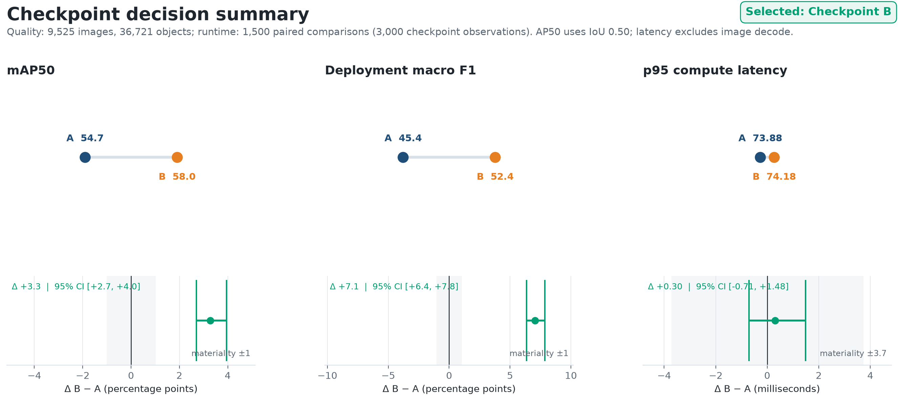
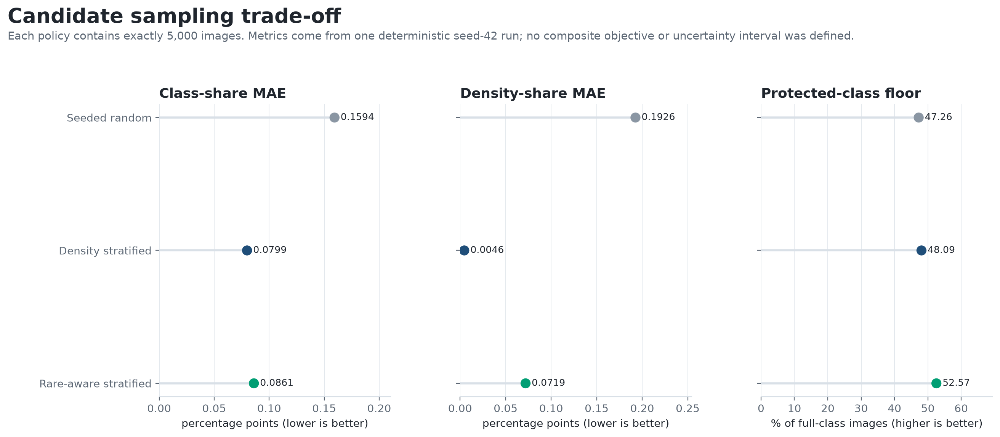
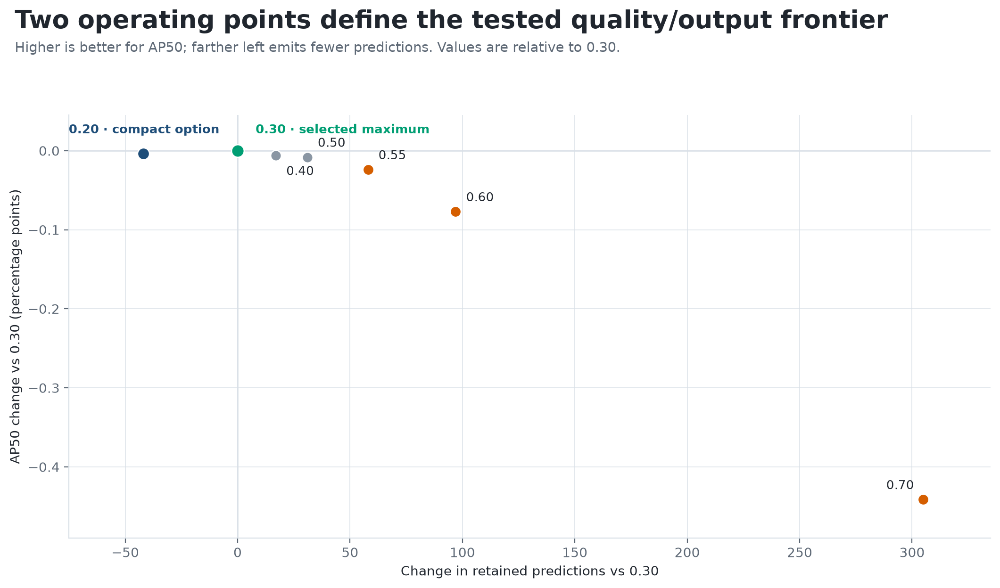
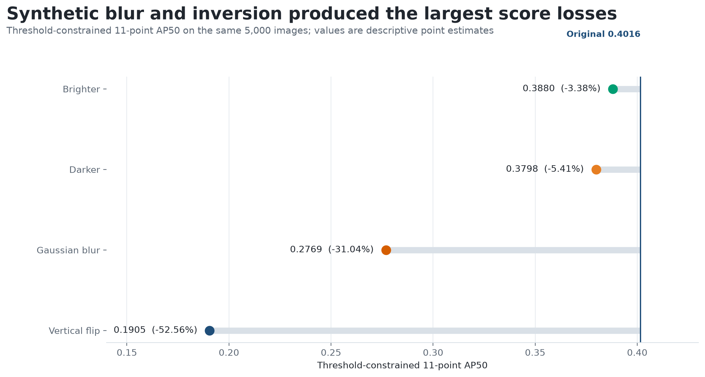
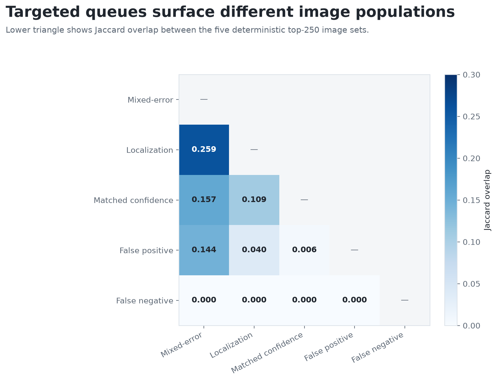

# Warehouse Object Detection — Engineering Report

## Executive summary

This project implements a reproducible object-detection system for logistics and
warehouse video. It accepts local files or UDP streams, samples decoded frames,
runs YOLOv4-tiny through OpenCV DNN, applies explicit confidence policy and
class-aware non-maximum suppression (NMS), and emits structured detections with
optional annotated JPEGs. A separate evidence pipeline validates the available
corpus, selects a checkpoint, defines a bounded development workload, evaluates
post-processing and controlled input shifts, and converts image-level failures
into deterministic review queues.

The principal engineering decisions are:

1. **Checkpoint B** is the fixed model baseline. It improved full-corpus macro
   AP50 by 0.0328 over Checkpoint A, with a paired source-group bootstrap interval
   that excluded zero; measured runtime did not distinguish the candidates.
2. A deterministic **5,000-image development workload** preserves the measured
   class, density, and crowding margins of the 9,525-image available corpus while
   satisfying explicit protected-class coverage targets.
3. Class-aware **NMS IoU 0.30** is retained as a provisional, quality-first
   operating point. Performance was nearly flat through 0.50; permissive settings
   added output and geometric redundancy without improving measured quality.
4. Controlled input shifts identify **spatial smoothing as the first field-
   validation hypothesis**. Gaussian blur produced a 31.0% relative AP50 decline;
   vertical flip produced a larger diagnostic loss but is not a normal deployment
   scenario.
5. Failure review remains **multidimensional**. The complete component table
   preserves 1,677 no-prediction images containing 4,193 labels; five specialized
   top-250 queues have low overlap and expose distinct review populations.

These are relative engineering results on the available external data and
checkpoints. They are not claims of independent generalization, production safety,
or performance in an unrelated warehouse.

**Figure 1. Runtime inference, controlled evaluation, and operational diagnosis**

**Interpretation.** Runtime inference, controlled evaluation, and operational
diagnosis share model and data contracts but remain separate concerns. This
separation allows post-processing, metrics, and review priorities to change
without embedding those decisions inside the model adapter.

## 1. System boundary and runtime architecture

The external inputs are videos, labeled images, a 20-class vocabulary, and two
compatible YOLOv4-tiny checkpoint bundles. The repository does not train a model
and does not version the external assets. It owns the inference service,
post-processing policy, evaluation logic, experiment orchestration, packaging,
and tests.

**Table 1. Runtime responsibilities**

| Stage | Implementation | Responsibility |
|---|---|---|
| Ingestion and sampling | [`Preprocessing.capture_video`](../detector_service/modules/inference/preprocessing.py) | Open a local video file or UDP stream; yield every configured frame |
| Model/DNN adapter | [`Detector.predict`](../detector_service/modules/inference/model.py) | Build the OpenCV blob and execute the Darknet checkpoint |
| Candidate decoding | [`Detector.post_process`](../detector_service/modules/inference/model.py) | Decode pixel-space boxes, objectness, and class scores |
| Confidence and NMS | [`NMS.filter`](../detector_service/modules/inference/nms.py) | Rank by combined confidence and suppress same-class overlap |
| Service orchestration | [`InferenceService.run`](../detector_service/app.py) | Coordinate sampling, inference, reporting, annotation, and frame limits |
| Evaluation | [`match_detections`](../detector_service/modules/utils/metrics.py), [`calculate_precision_recall_curve`](../detector_service/modules/utils/metrics.py), and [`calculate_map_x_point_interpolated`](../detector_service/modules/utils/metrics.py) | Perform same-class, one-to-one matching and AP calculation |

**Interpretation.** The runtime is modular at the boundaries that affect
correctness: decoding, confidence construction, suppression, and matching are
independently testable. The service layer coordinates those components without
duplicating their numerical logic.

The detector first rejects raw candidates below the objectness boundary. It then
uses combined confidence—objectness multiplied by the predicted-class
probability—for retention and NMS ranking. Suppression is class-aware: overlapping
predictions compete only when they predict the same class. This prevents unrelated
classes from suppressing one another solely because their boxes overlap.

The container includes code and pinned runtime dependencies, while datasets,
checkpoints, videos, and outputs are mounted at runtime. OpenCV is pinned to the
4.13 line because OpenCV 5 removed the legacy Darknet importer used by the
external `cfg` and `weights` bundles.

## 2. Checkpoint selection

The two checkpoint candidates share configuration and vocabulary, so the primary
comparison isolates learned weights. Both were evaluated on the same 9,525 images
and 36,721 labels under a low candidate floor, class-aware NMS IoU 0.30, same-
class one-to-one matching at IoU 0.50, and 101-point AP50. Quality uncertainty was
estimated with a paired bootstrap grouped by source-family identity.

**Figure 2. Quality-first checkpoint decision**

**Interpretation.** Checkpoint B cleared the primary selection rule with an AP50
gain of 0.032792 and 95% interval [0.027042, 0.039543]. Configured operating-point
macro F1 improved by 0.070629. The p95 runtime interval crossed zero, so latency
was non-decisive.

**Table 2. Checkpoint decision evidence**

| Decision measure | Checkpoint A | Checkpoint B | B − A |
|---|---:|---:|---:|
| Full-corpus macro AP50, 101-point | 0.546805 | 0.579597 | +0.032792 |
| Configured macro F1 | 0.453841 | 0.524471 | +0.070629 |
| Classes with higher AP50 | 1 of 20 | 19 of 20 | — |
| Paired p95 compute latency | — | — | +0.299 ms; interval crosses 0 |

**Interpretation.** The quality gain is broad rather than driven by one category:
B improves 19 classes. Car is the only counterexample, with a small AP50 decline
of 0.001897. Runtime remains tied within the measured Windows CPU environment and
is not used to justify the model choice.

## 3. Coverage-preserving development workload

Repeated threshold and perturbation studies required a smaller, stable workload.
Corpus indexing accepted 9,525 image/label pairs, 36,721 structurally valid YOLO
rows, and 20 classes. The distribution is highly imbalanced: wood pallet accounts
for 9,330 objects, while gloves accounts for 256.

Three 5,000-image candidates were compared: unstructured random sampling,
density-stratified sampling, and rare-aware density-stratified sampling. The
selected policy enforces explicit image-coverage targets for eight protected
classes, then fills remaining capacity within six label-density strata.

**Figure 3. Sampling candidates on their native decision measures**

**Interpretation.** Rare-aware density stratification accepts a small increase in
mean class-share and density-share error relative to density-only sampling in
exchange for a 4.48 percentage-point improvement in minimum protected-class
retention. All eight protected targets are met; no normalized composite score is
used.

The selected manifest contains 5,000 indexed images and 19,196 labeled objects.
Its maximum absolute object-share drift is 0.3192 percentage points, maximum
density-bucket drift is 0.1278 points, and maximum crowding-bucket drift is 0.3230
points. It also defines a 1,021-image crowded slice containing 11,411 labels for
within-slice sensitivity checks.

This is a development workload, not an independent test set. Selection uses
labels, the same manifest supports later operating-point studies, and source-
family duplication can remain.

## 4. NMS operating-point sensitivity

Checkpoint B and the 5,000-image manifest were frozen while class-aware NMS IoU
was swept over 0.20, 0.30, 0.40, 0.50, 0.55, 0.60, and 0.70. Candidate objectness
and combined-confidence retention remained at 0.50. The study therefore isolates
post-processing sensitivity within that configured operating point.

**Figure 4. Quality and output-volume frontier across NMS settings**

**Interpretation.** IoU 0.30 is the exact measured quality maximum; IoU 0.20 is a
more compact near-equivalent, retaining 42 fewer predictions for a 0.0039
percentage-point AP50 loss. Every setting from 0.40 upward retains more output
while scoring lower than 0.30.

The selected 0.30 setting produces threshold-constrained 11-point AP50 of
0.401573 and 7,727 retained predictions. Through 0.50, AP50 spans only 0.0083
percentage points. Above 0.50, surviving same-class high-overlap pairs rise from
28 at 0.55 to 301 at 0.70; AP50 at 0.70 falls to 0.397159.

The current pipeline records this choice with a deterministic, independently
verified rule: maximize threshold-constrained 11-point AP50, then minimize
retained predictions, then choose the lower IoU threshold. That rule selects
0.30 from the seven tested settings. The decision remains provisional because
the sweep has no untouched confirmation set or uncertainty interval; the full
and crowded views provide supporting context, while permissive thresholds add
redundancy without measured improvement.

## 5. Controlled input-shift diagnostics

The selected detector and NMS policy were evaluated on the same 5,000 images under
five separately applied conditions: original, brighter/higher contrast,
darker/lower contrast, Gaussian blur, and vertical flip. Labels were transformed
when geometry changed. These are inference-time perturbations, not training
augmentation.

**Figure 5. Aggregate quality under controlled image conditions**

**Interpretation.** The two exposure transforms produce smaller observed losses
than blur and flip. Gaussian blur lowers AP50 by 0.124665 (31.0% relative) and is
the highest-priority operational validation hypothesis among the tested
conditions. Vertical flip lowers AP50 by 0.211054, but it is an orientation stress
test rather than a normal deployment-risk estimate.

**Table 3. Controlled input-shift result**

| Condition | AP50 | Change from original | Retained predictions |
|---|---:|---:|---:|
| Original | 0.401573 | — | 7,727 |
| Brighter | 0.388012 | −3.38% relative | 7,285 |
| Darker | 0.379839 | −5.41% relative | 6,898 |
| Gaussian blur | 0.276908 | −31.04% relative | 4,036 |
| Vertical flip | 0.190519 | −52.56% relative | 3,529 |

**Interpretation.** Prediction count provides output-volume context but is not a
recall metric. The blur result motivates camera-derived defocus, motion-blur, and
compression testing across multiple severities; one synthetic smoothing kernel
does not establish field robustness.

## 6. Targeted detector-error review

Aggregate AP does not identify which images an engineer should inspect. The final
analysis aligns retained predictions and labels by image, performs same-class
one-to-one matching at IoU 0.50, and stores localization, matched-confidence,
false-positive, and false-negative error components. Five deterministic policies
then produce mixed-error and specialist top-250 queues.

**Figure 6. Pairwise overlap of specialized review queues**

**Interpretation.** The maximum off-diagonal overlap is 0.259 between mixed-error
and localization. The false-negative queue has zero overlap with the other four
top-250 lists, and all 250 of its images are complete misses. Separate objectives
surface different review populations.

Across the complete workload, 1,677 images have no retained prediction and
contain 4,193 labels. Preserving a row for every selected image prevents silent
failures from disappearing when predictions are sparse. Fire occurs in 51.2% of
the complete-miss queue and smoke in 23.6%; these are review priorities, not
class-quality estimates or automatic retraining instructions.

## 7. Verification and reproducibility

The codebase separates asset-independent contracts from external-asset runs.
Unit and integration tests cover video-resource cleanup, candidate decoding,
combined-confidence math, class-aware suppression, one-to-one matching,
augmentation geometry, cache validation, deterministic sampling, experiment
schemas, atomic artifact promotion, and container packaging. GitHub Actions runs
the public test suite under Python 3.12 and builds the inference container without
embedding external assets or publishing an image.

**Table 4. Reproduction entry points**

| Concern | Command or entry point |
|---|---|
| Runtime inference | `python -m detector_service.app --help` |
| Test suite | `python -m unittest discover -s tests -v` |
| Checkpoint comparison | `experiments/scripts/01_model_comparison.py` |
| Dataset workload | `experiments/scripts/02_dataset_sampling.py` |
| NMS sweep | `experiments/scripts/03_nms_threshold_sweep.py` |
| Input-shift diagnostics | `experiments/scripts/04_augmentation_robustness.py` |
| Error-review queues | `experiments/scripts/05_build_hnm_components.py` → `experiments/scripts/05_build_error_review_queues.py` |

**Interpretation.** Each analytical responsibility has an explicit entry point;
Experiment 05 deliberately separates reusable per-image error evidence from the
review-queue policy that consumes it. The runtime and test commands exercise the
deployable service and its contracts. Numbering makes the dependency order
visible without coupling report generation to model inference.

**Table 5. Retained evidence provenance and availability**

| Evidence | Retained identity | Availability |
|---|---|---|
| Checkpoint quality | `full-20260821-v2` | Local, ignored manifest-backed run package |
| Paired runtime | `runtime-500x3-seed20260821-v1` | Local, ignored manifest-backed run package |
| Checkpoint decision | `selection-20260821-v1` | Local, ignored manifest-backed run package |
| Dataset and workload analysis | Canonical Experiment 02 stage directories defined in the [output contract](../experiments/OUTPUTS.md) | Local, ignored derived evidence with schema, population, and cross-table validation |
| NMS operating point | `operating_point.json` plus its two hashed seven-row evidence tables | Local, ignored decision record linked to the verified checkpoint selection |
| Input-shift evidence | Canonical Experiment 04 stage directories | Local, ignored derived evidence; the report builder validates schemas, population alignment, and the Experiment 03 baseline |
| Error-review evidence | Canonical Experiment 05 component and queue stage directories | Local, ignored derived evidence; the queue builder resolves and verifies the selected checkpoint and NMS decision before consuming predictions |
| Public report figures | [Figure manifest](figures/FIGURE_MANIFEST.json) | Tracked presentation assets derived from validated evidence |

**Interpretation.** Expensive model inference is separated from deterministic
post-processing and reporting where practical. Experiment 01 uses immutable,
manifest-backed run-ID packages. The NMS operating-point record independently
recomputes its decision from package-local hashed evidence and links it to the
checkpoint decision. Later stages revalidate canonical derived tables and
require fresh evidence when upstream inputs or policies change rather than
silently reusing stale results.

Full inference reruns require the externally managed dataset, checkpoints, and
class vocabulary. The generated CSV evidence and detailed experiment reports
remain local and ignored; the tracked output contract documents their schemas and
ownership without exposing machine-local asset paths.

## 8. Limitations and next engineering work

- The dataset, vocabulary, videos, and checkpoints are external. Their training-
  data overlap and provenance are not fully known.
- Full-corpus checkpoint selection leaves no untouched confirmation set.
  Experiments 02–05 share a label-informed development workload.
- Experiment 01 uses low-floor 101-point AP50; Experiments 03 and 04 use
  threshold-constrained 11-point AP50. Their absolute values are not directly
  comparable.
- Runtime measurements are environment-specific and do not establish GPU,
  embedded-device, or multi-stream capacity.
- Synthetic exposure, blur, and flip conditions do not substitute for camera-
  derived field data, repeated severities, temporal behavior, or calibrated
  uncertainty.
- Error queues prioritize inspection; manual review is required to distinguish
  detector failure, thresholding, annotation error, ambiguity, and domain shift.
- The project evaluates pretrained checkpoints. Model training, deployment
  monitoring, alerting, and automated retraining are outside its current scope.

The next highest-value work is to collect a source-grouped, untouched field set;
measure camera-derived blur, compression, and low-light severity curves; define
business-weighted error costs; and benchmark sustained UDP throughput on the
intended deployment hardware. Those additions would convert the current
development evidence into a stronger release qualification process.
