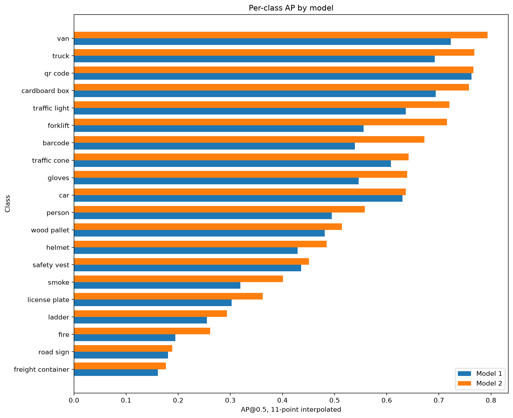
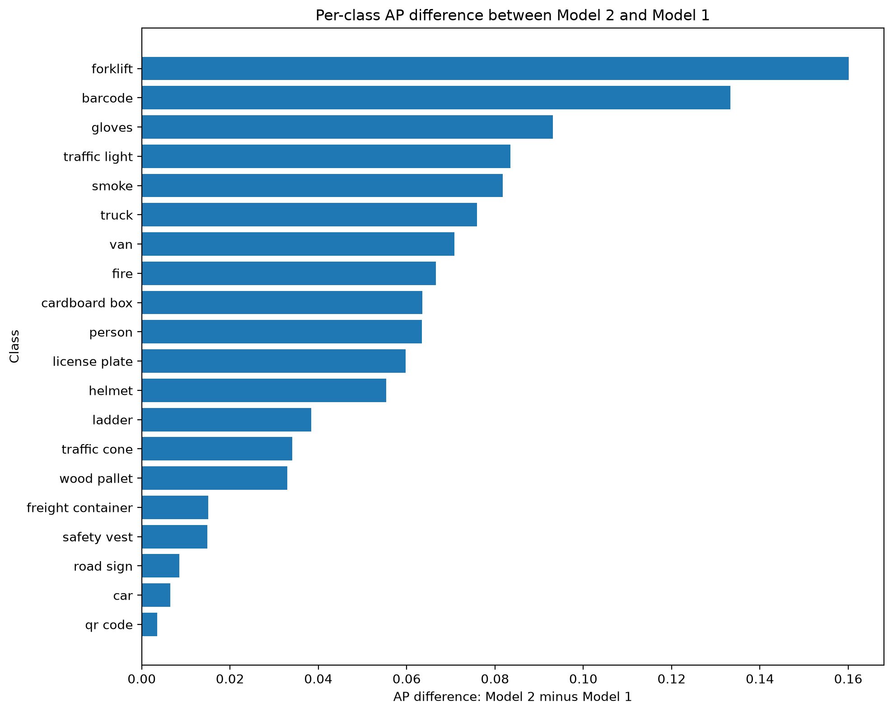

# Model Selection and Baseline Evaluation

### Methodology

Two YOLO-based object detection models were evaluated on the full warehouse logistics dataset. The dataset contains 9,525 images, 36,721 labeled object instances, and 20 object classes. Predictions were generated using a score threshold of 0.5 and an NMS threshold of 0.4. Model performance was evaluated with IoU@0.5 and 11-point interpolated mAP using the implemented `metrics.py` pipeline.

The purpose of this analysis was to determine which model should be used as the baseline detector for the remaining analyses. The comparison uses both aggregate mAP and per-class AP because a single overall metric can hide weak performance on individual classes.

### Table 1: Overall Model Comparison Metrics

| Model   | mAP@0.5 | Ground Truth Objects | Predictions After NMS | Score Threshold | NMS Threshold | Evaluation IoU Threshold |
| ------- | ------: | -------------------: | --------------------: | --------------: | ------------: | -----------------------: |
| Model 1 |  0.4820 |               36,721 |                19,302 |             0.5 |           0.4 |                      0.5 |
| Model 2 |  0.5401 |               36,721 |                20,828 |             0.5 |           0.4 |                      0.5 |

**Table 1: Overall model comparison on the full warehouse logistics dataset.** The table shows that Model 2 achieves higher mAP@0.5 than Model 1 while also producing more post-NMS detections.

**Interpretation and design impact.** Model 2 is the stronger aggregate detector, raising mAP@0.5 from 0.4820 to 0.5401. However, the higher prediction count means the model is also more active after NMS. That is not automatically a problem because aggregate mAP is higher, but it creates a design trade-off that must be checked later: additional detections may represent useful true positives, but they may also increase false positives or duplicate detections under different threshold settings. For that reason, Model 2 should be selected as the baseline, but NMS-threshold analysis should still examine NMS behavior carefully.

### Figure 1: Per-Class AP by Model

**Figure 1: Per-class AP by model.** This figure compares the absolute AP@0.5 score for Model 1 and Model 2 across all 20 object classes. The key point to observe is whether Model 2’s higher aggregate mAP reflects broad class-level strength or only a few isolated class gains.

**Interpretation and design impact.** Model 2 has higher AP than Model 1 for every object class, which means the model-selection decision is not driven by one or two outlier classes. The figure also shows that several classes remain weaker in absolute AP even under Model 2, including classes such as freight container, road sign, fire, and ladder. This matters because the final system should not treat Model 2 as fully solved simply because it wins the aggregate comparison. The lower-performing classes identify areas where threshold tuning, augmentation, monitoring, or future data collection may still be needed.

### Figure 2: Per-Class AP Difference

**Figure 2: Per-class AP difference between Model 2 and Model 1.** This figure shows the AP difference calculated as Model 2 AP minus Model 1 AP. Positive values show classes where Model 2 exceeded Model 1.

**Interpretation and design impact.** Model 2 exceeds Model 1 for every class, but the AP advantages are not evenly distributed. The largest margins appear for forklift, barcode, gloves, traffic light, smoke, truck, and van. Several of these classes are important for warehouse safety or operational control. For example, forklift, smoke, gloves, and traffic light detections can affect how a robot or monitoring system interprets risk in a shared work environment. This supports using Model 2 as the baseline for the remaining tasks because its advantage is strongest on several deployment-relevant classes, not only on common background logistics objects.

### Table 2: Largest Model 2 AP Advantages

| Class         | Ground Truth Count | Model 1 AP | Model 2 AP | Model 2 AP Advantage |
| ------------- | -----------------: | ---------: | ---------: | -------------------: |
| forklift      |              1,103 |     0.5557 |     0.7158 |               0.1601 |
| barcode       |                283 |     0.5388 |     0.6721 |               0.1333 |
| gloves        |                256 |     0.5461 |     0.6392 |               0.0931 |
| traffic light |              1,193 |     0.6365 |     0.7200 |               0.0835 |
| smoke         |              1,495 |     0.3191 |     0.4008 |               0.0817 |
| truck         |                782 |     0.6922 |     0.7682 |               0.0760 |
| van           |                765 |     0.7227 |     0.7936 |               0.0708 |

**Table 2: Largest Model 2 AP advantages over Model 1.** The table isolates the classes where Model 2 most strongly exceeds Model 1 in AP@0.5.

**Interpretation and design impact.** The largest Model 2 AP advantages include both operational classes, such as forklift, truck, van, and barcode, and safety-relevant classes, such as gloves, smoke, and traffic light. This pattern is important because it shows that Model 2 is not merely exceeding Model 1 on visually easy or low-risk classes. However, smoke also illustrates a remaining limitation: although Model 2 exceeds Model 1 by 0.0817 AP, its absolute AP remains only 0.4008. That means Model 2 is better, but not necessarily reliable enough for smoke detection without additional monitoring, data improvement, or threshold analysis.

## Conclusion

Model 2 is selected as the baseline detector for the remaining analyses because it achieves higher overall mAP@0.5 and higher AP for every object class. The decision is supported by both aggregate and per-class evidence. The main trade-off is that Model 2 also produces more post-NMS detections, so later NMS threshold analysis should examine whether those additional detections improve recall without creating excessive false positives or duplicate detections.

The model comparison also shows that class-level evaluation is necessary for this system. Model 2 is consistently stronger than Model 1, but some classes remain weak in absolute terms. These weaker classes should be carried forward into the later sampling, threshold, augmentation, and hard-negative-mining analysis because they represent the likely failure points of the deployed detection system.
