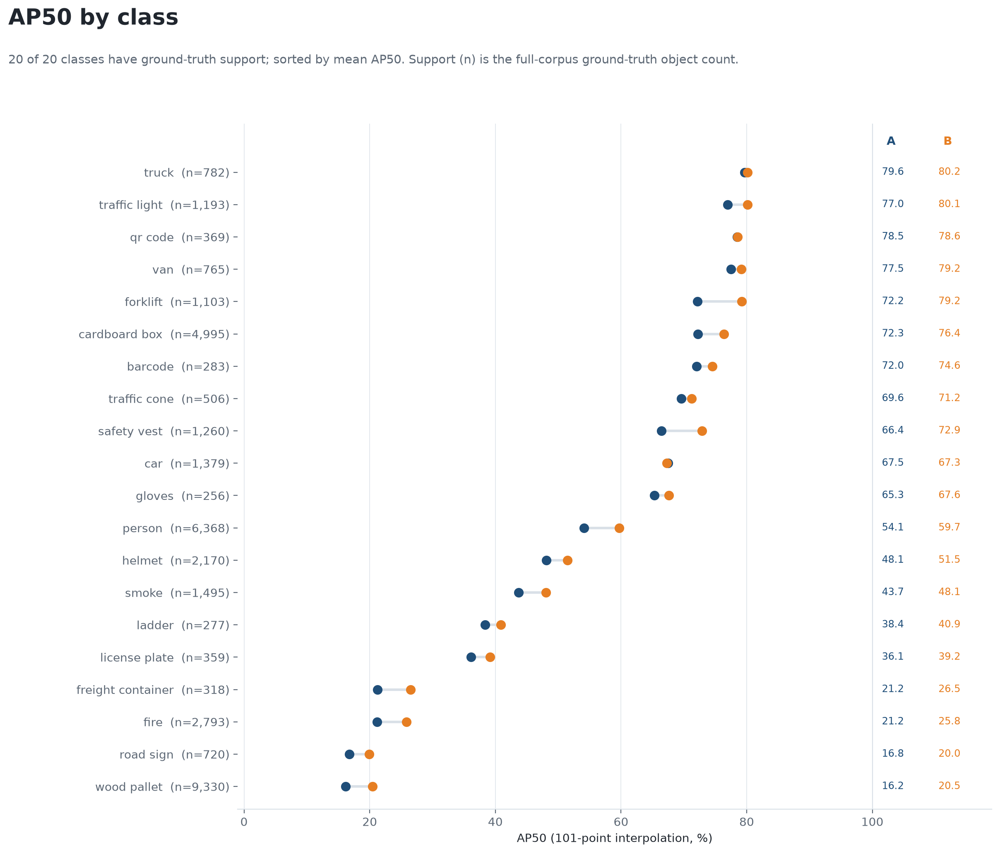
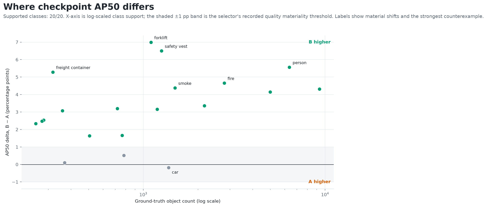
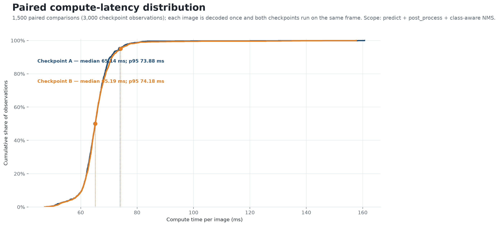
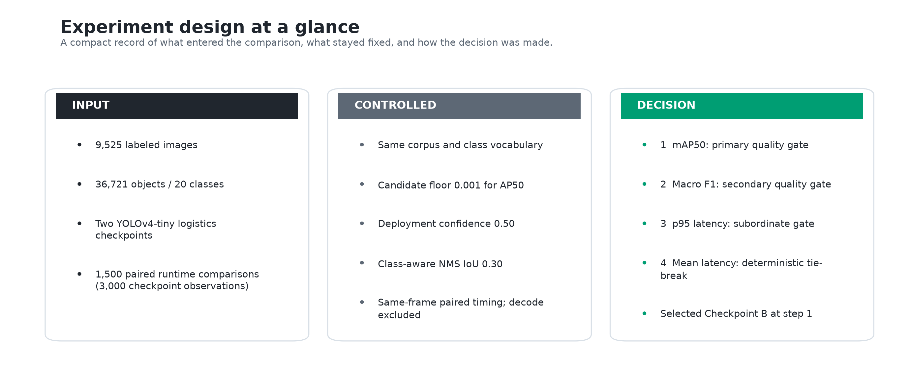

# Experiment 01 — Checkpoint Selection Under a Locked Evaluation Protocol

## Decision

Checkpoint B (`model2`) was selected as the detection baseline for subsequent
experiments. On the available supplied corpus of 9,525 images and 36,721 labeled
objects, it increased macro AP50 by **0.0328** over Checkpoint A
(`95% CI [0.0270, 0.0395]`). This satisfied the deterministic Step 1 selection
rule encoded in the selector: an absolute AP50 difference of at least 0.01 with
a paired interval that excludes zero. At the configured deployment threshold, B
also increased macro F1 by
**0.0706** (`95% CI [0.0636, 0.0785]`). Paired runtime evidence did not establish
a meaningful latency difference.

This is a relative checkpoint decision for the supplied corpus under the fixed
policy documented below. It is not an independent generalization result: the
checkpoints and data are external inputs, their training-data overlap is unknown,
and using the complete labeled corpus for selection leaves no untouched
confirmatory set.

**Figure 1. Selection summary — quality determined the decision; latency was non-decisive**

**Interpretation.** B's AP50 improvement is both larger than the locked practical
threshold and supported by the source-group bootstrap. The secondary operating-
point result points in the same direction. The p95 latency interval crosses zero,
so runtime neither supports nor contradicts the quality-based selection.

## Why this experiment was necessary

Two drop-in-compatible YOLOv4-tiny checkpoints were available for the same
20-class logistics vocabulary. Before tuning post-processing or analyzing
robustness, the project needed one stable checkpoint so that downstream changes
would measure operating-policy effects rather than silently mix model changes
with threshold changes.

The decision question was therefore narrow: **which checkpoint provides the
stronger quality baseline on the available corpus when preprocessing, candidate
gating, NMS, matching, and metric definitions are held constant—and does that
choice impose a material compute-latency penalty?**

**Table 1. Candidate identity and compatibility controls**

| Report label | Implementation label | Weights SHA-256 | Shared configuration | Shared vocabulary |
|---|---|---|---|---|
| Checkpoint A | `model1` | `5f3d6e98…7a83f14e` | `75c54cb0…7898ad1c` | `83398377…68d8d69` |
| Checkpoint B | `model2` | `b58fbc33…ccd1b7c8` | `75c54cb0…7898ad1c` | `83398377…68d8d69` |

**Interpretation.** The candidates differ in learned weights, while the Darknet
configuration and class-name vocabulary are byte-identical. This isolates the
comparison to checkpoint behavior rather than architecture or label-schema
differences.

## Evaluation design

The evaluation policy was fixed before interpreting the full run. Both
checkpoints received the same decoded pixels and were evaluated against the same
labels. Combined confidence is objectness multiplied by the predicted-class
probability. Class-aware non-maximum suppression (NMS) removes overlapping
same-class duplicates without forcing different classes to compete. A prediction
matches at most one unused ground-truth box of the same class at intersection
over union (IoU) of at least 0.50.

The primary measure is `mAP50_101pt`: average precision calculated at IoU 0.50
from 101 recall points for each class, then macro-averaged across all 20 classes.
It is AP50, not COCO mAP averaged across several IoU thresholds. The deployment
view filters the same stored post-NMS predictions at combined confidence 0.50;
it does not rerun inference under a second policy.

**Table 2. Fixed quality and runtime controls**

| Control | Locked setting | Rationale |
|---|---:|---|
| Quality population | 9,525 images; 36,721 labels; 20 classes | Use all available indexed evidence for the relative decision |
| Candidate objectness | `> 0.001` | Preserve low-score candidates needed to estimate a precision–recall curve |
| Post-NMS score floor | combined confidence `>= 0.001` | Retain the score range used for AP50 |
| Class-aware NMS | IoU `0.30` | Apply identical duplicate suppression to both checkpoints |
| Evaluation match | same class, IoU `>= 0.50`, one-to-one | Prevent duplicate predictions from claiming one object repeatedly |
| Deployment view | combined confidence `>= 0.50` | Compare the configured operating point |
| Quality uncertainty | 2,000 paired source-group bootstrap draws; seed `20260821` | Keep related image variants together and preserve checkpoint pairing |
| Runtime sample | 500 density-stratified images; 3 repeats; 20 warm-ups per checkpoint | Measure both checkpoints on identical frames after warm-up |

**Interpretation.** The controls separate checkpoint identity from inference and
evaluation policy. Low-floor predictions answer the ranking-quality question;
the 0.50 view answers the configured deployment question; the paired benchmark
answers only the compute-cost question.

The corpus contained 8,822 source groups, defined as the filename prefix before
`_jpg.rf.` when present and otherwise the complete filename. Each bootstrap draw
resampled groups rather than independent image rows, preserving related variants
within a draw. The reported 95% intervals are the 2.5th and 97.5th percentiles of
2,000 paired `B − A` replicates.

## Full-corpus quality result

**Table 3. Aggregate checkpoint quality on the locked corpus**

| Metric | Checkpoint A | Checkpoint B | B − A | Paired 95% CI |
|---|---:|---:|---:|---:|
| mAP50, 101-point macro | 0.5468 | **0.5796** | **+0.0328** | `[+0.0270, +0.0395]` |
| Deployment macro F1 at 0.50 | 0.4538 | **0.5245** | **+0.0706** | `[+0.0636, +0.0785]` |
| Relative mAP50 change | — | — | +5.997% | descriptive |
| Relative macro-F1 change | — | — | +15.563% | descriptive |

**Interpretation.** B satisfies the Step 1 rule directly: the AP50 difference
exceeds +0.01 and its interval remains above zero. The lexicographic selector
therefore chooses B at Step 1. Macro F1 is secondary supporting evidence in the
recorded selection rule, but it did not enter the decision because the primary
gate had already resolved the comparison; runtime was likewise non-decisive.

## Class-level behavior

Aggregate improvement can conceal regressions or gains concentrated in a single
dominant class. The per-class view therefore reports all 20 AP50 values alongside
ground-truth support. These differences are descriptive: the confirmatory
bootstrap applies to the macro effects above, not to individual classes.

**Figure 2. Per-class AP50 for both checkpoints, with labeled support**

**Interpretation.** B improves AP50 in 19 of 20 classes, so the macro result is not
driven by one category. The chart also exposes the wide range of class support;
small-support categories should be interpreted more cautiously even when their
point differences are large.

**Figure 3. AP50 difference versus class support**

**Interpretation.** Large positive changes appear in both high-support categories
such as `person` and smaller categories such as `freight container`. `car` is the
only negative class and its change is small. Support is included to prevent a
large percentage-point difference in a sparse class from being mistaken for the
same evidence strength as a similar change in a common class.

**Table 4. Largest positive class changes and the strongest counterexample**

| Class | Ground-truth objects | A AP50 | B AP50 | B − A (percentage points) |
|---|---:|---:|---:|---:|
| Forklift | 1,103 | 0.7219 | 0.7918 | +6.99 |
| Safety vest | 1,260 | 0.6640 | 0.7290 | +6.50 |
| Person | 6,368 | 0.5412 | 0.5968 | +5.56 |
| Freight container | 318 | 0.2121 | 0.2649 | +5.28 |
| Fire | 2,793 | 0.2117 | 0.2582 | +4.65 |
| Car | 1,379 | 0.6745 | 0.6726 | −0.19 |

**Interpretation.** The leading gains cover material operational categories,
including forklifts, people, and safety vests. The small decline for `car`
prevents an absolute claim that B is better for every class and should remain on
the monitoring list if vehicle detection becomes a deployment priority.

## Configured deployment operating point

AP50 measures ranking behavior across confidence levels; it does not describe
what the service emits at one threshold. The 0.50 operating-point view shows
that B's improvement comes primarily from recovering more labeled objects while
also producing slightly fewer false positives.

**Table 5. Detection outcomes at combined confidence 0.50**

| Metric | Checkpoint A | Checkpoint B | Change |
|---|---:|---:|---:|
| Retained predictions | 12,302 | 14,530 | +2,228 |
| True positives | 10,473 | 12,755 | +2,282 |
| False positives | 1,829 | 1,775 | −54 |
| False negatives | 26,248 | 23,966 | −2,282 |
| Micro precision | 0.8513 | **0.8778** | +0.0265 |
| Micro recall | 0.2852 | **0.3473** | +0.0621 |
| Micro F1 | 0.4273 | **0.4977** | +0.0705 |

**Interpretation.** B adds 2,228 emitted detections but converts that higher
output volume into 2,282 additional true positives and 54 fewer false positives.
Recall remains modest at 0.50 for both checkpoints, so later operating-point
work should treat the confidence threshold as a tunable product parameter rather
than assuming the checkpoint decision also solved threshold selection.

## Paired compute-latency result

The runtime benchmark decoded each sampled image once, ran both checkpoints on
the same frame, alternated which checkpoint executed first, and timed prediction,
post-processing, and class-aware NMS. Dataset discovery, model loading, image
decode, artifact serialization, and plotting were outside the measured compute
scope. The sample contained 500 images from 498 source groups, three repeats,
and 1,500 paired comparisons—1,500 observations per checkpoint and 3,000 total—
with no unreadable images.

**Figure 4. Empirical distribution of paired per-image compute latency**

**Interpretation.** The latency distributions largely overlap. B's observed
median and p95 are marginally higher, but the paired intervals include zero and
the p95 difference is far below the protocol's 5% practical threshold.

**Table 6. Paired runtime summary in the measured Windows CPU environment**

| Metric | Checkpoint A | Checkpoint B | B − A | Paired 95% CI for B − A |
|---|---:|---:|---:|---:|
| Median compute latency | 65.143 ms | 65.188 ms | +0.044 ms | descriptive |
| Mean compute latency | 65.434 ms | 65.708 ms | +0.274 ms | `[−0.047, +0.627] ms` |
| p95 compute latency | 73.883 ms | 74.182 ms | +0.299 ms | `[−0.707, +1.485] ms` |

**Interpretation.** No measured runtime difference is statistically resolved or
operationally material under this protocol. Because Step 1 already selected B,
runtime could not override the decision in any case; it establishes that the
quality gain did not come with a demonstrated compute penalty in this test.

## Evidence integrity and implementation map

The experiment separates model inference, runtime measurement, and decision
logic so each claim has a clear owner. The validation path reconciles the
expected population before accepting a result. The full quality run contains
19,050 processed model–image ledger rows—exactly two checkpoints for each of
9,525 images—and no silently dropped inputs.

**Figure 5. Experiment design — inputs, controlled comparison, and decision output**

**Interpretation.** External assets enter through a validated index; both
checkpoints then share the same inference and scoring policy. Quality and paired
runtime evidence remain separate until the locked selector verifies both inputs
and applies the lexicographic rule.

**Table 7. Implementation map and integrity responsibility**

| Code path | Primary responsibility |
|---|---|
| `experiments/scripts/01_model_selection/01_compare_model_quality.py` — `load_and_validate_index`, `run_inference_for_model`, `evaluate_model`, `verify_run_directory` | Validate the corpus and assets, run both checkpoints, compute metrics, and verify the quality evidence |
| `detector_service/modules/inference/model.py` — `Detector` | Load Darknet assets and decode model outputs into candidates |
| `detector_service/modules/inference/nms.py` — `NMS` | Apply combined-confidence filtering and class-aware suppression |
| `detector_service/modules/utils/metrics.py` — `match_detections`, `calculate_precision_recall_curve`, `calculate_map_x_point_interpolated` | Enforce same-class one-to-one matching and calculate AP50 |
| `experiments/scripts/01_model_selection/02_benchmark_inference_latency.py` — `stratified_density_sample`, `benchmark_paired`, `paired_source_group_bootstrap` | Build the deterministic paired runtime sample and latency intervals |
| `experiments/scripts/01_model_selection/03_select_checkpoint.py` — `validate_quality_run`, `validate_runtime_run`, `paired_quality_bootstrap`, `apply_selection_rule` | Re-verify upstream evidence, estimate quality uncertainty, and apply the locked decision rule |

**Interpretation.** The boundaries make each claim traceable to a specific
functional stage. Inference produces checkpoint observations, the runtime
benchmark measures the paired cost, and the selector applies the declared rule
only after both populations reconcile.

## Engineering decision and downstream impact

The locked rule selected **Checkpoint B at Step 1** with reason
`qualifying_low_floor_ap50`. B therefore becomes the single checkpoint baseline
for dataset-overlap analysis, NMS operating-point evaluation, controlled
input-shift diagnostics, and targeted detector-error review. Freezing the checkpoint here keeps
those experiments internally interpretable by preventing checkpoint substitution
from becoming a confounder when data selection, post-processing, or perturbation
policy changes.

The decision does not freeze the detector indefinitely. A future checkpoint can
enter through the same protocol, but it should be evaluated with separately
reserved confirmation data and explicit provenance before replacing the current
baseline.

## Limitations

- **Training overlap is unknown.** Neither checkpoint has a verified training
  manifest, so some or all evaluation images may have influenced checkpoint
  training. The result is a corpus-relative comparison, not an unbiased estimate
  of performance on unseen scenes.
- **No untouched confirmatory set remains.** The complete labeled corpus was
  used to make the selection. Bootstrap intervals quantify sampling variability
  within this corpus structure; they do not create new independent evidence.
- **External inputs define the scope.** The dataset, labels, class vocabulary,
  configurations, and pretrained weights are external assets. This experiment
  evaluates and selects between them; it does not claim to train the checkpoints.
- **Source grouping is a mitigation, not proof of independence.** Filename-based
  grouping keeps recognizable variants together but cannot detect every semantic
  duplicate or shared video sequence.
- **Runtime is environment-specific.** The paired run used Python 3.12.13,
  OpenCV 4.13.0, and Windows 11 on one CPU environment. It does not predict GPU,
  container, edge-device, or concurrent-service latency.
- **Per-class differences are descriptive.** No class-specific confidence
  intervals were used for selection, and operational costs may justify different
  thresholds by class.

Within those limits, the defensible conclusion is: **on the supplied 9,525-image
corpus and under the locked evaluation policy, Checkpoint B produced a supported
0.0328 absolute increase in mAP50 and a 0.0706 increase in deployment macro F1
relative to Checkpoint A, with no meaningful measured latency difference.**

## Implementation and reproducibility

The public entry points are:

- `experiments/scripts/01_model_selection/01_compare_model_quality.py` for full-corpus quality;
- `experiments/scripts/01_model_selection/02_benchmark_inference_latency.py` for paired runtime;
- `experiments/scripts/01_model_selection/03_select_checkpoint.py` for the locked decision.

The commands require the external asset root and the shared dataset index from
stage 00. Each script exposes its argument contract through `--help`. A complete
reproduction processes both checkpoints for all 9,525 images, records 3,000
runtime observations forming 1,500 paired comparisons, and applies 2,000 paired
source-group bootstrap draws. Success requires those populations and schemas to
reconcile, not merely for inference to exit without an exception.
