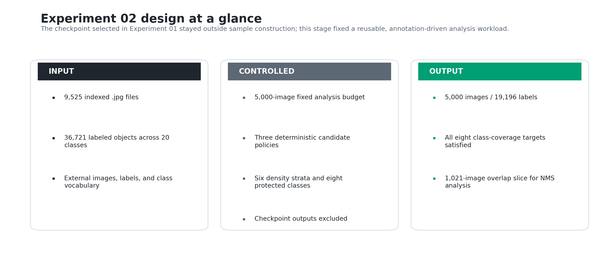
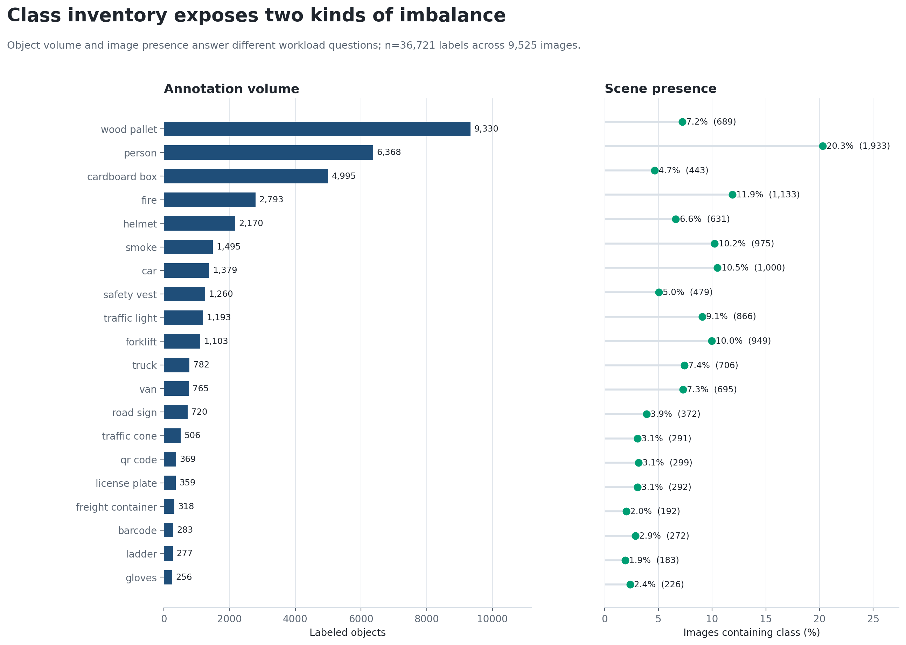
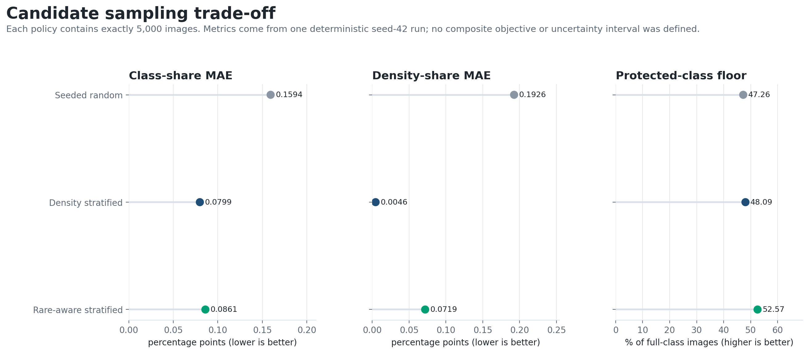
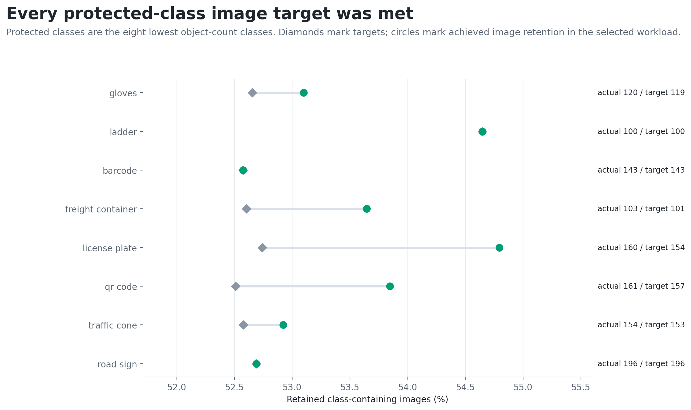
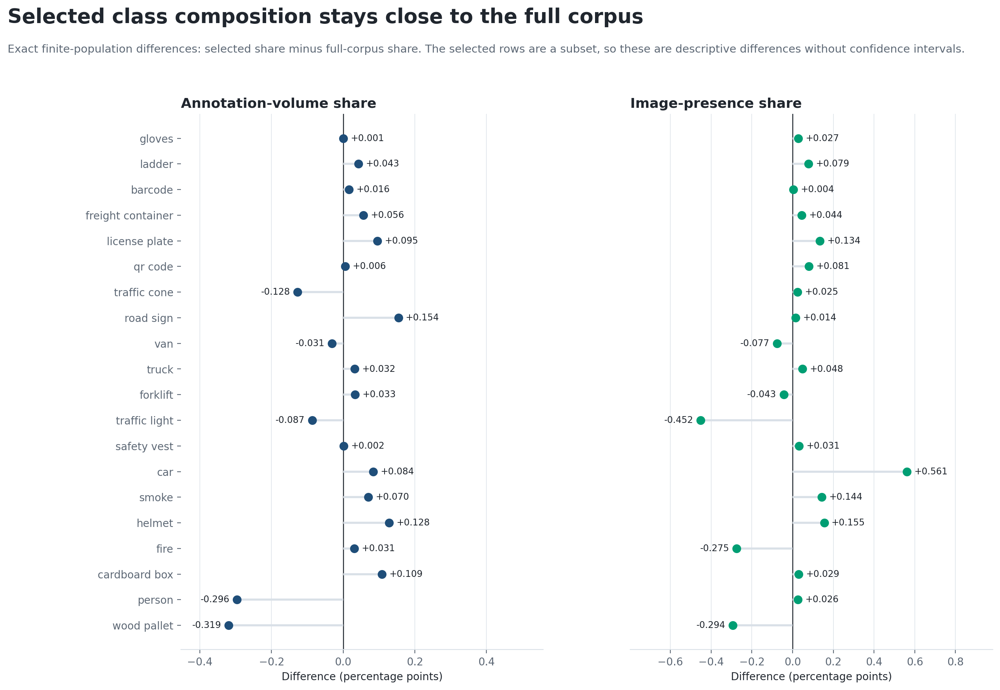
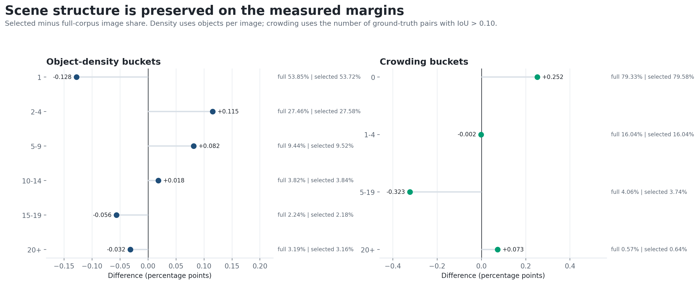

# Experiment 02 — Coverage-Preserving Analysis Workload

## Decision

Experiment 01 compared both detector checkpoints on all 9,525 indexed images and
selected Checkpoint B. Experiment 02 did not revisit that model decision. It used
ground-truth annotations only to turn the same corpus into a fixed, reusable
5,000-image analysis workload for downstream post-processing evaluation.

The selected rare-aware density-stratified workload contains 5,000 indexed image
paths and 19,196 labels. It satisfies explicit image-coverage targets for the eight
least frequent classes while keeping the largest observed class-share,
object-density, and crowding-bucket deviations to 0.3192, 0.1278, and 0.3230
percentage points, respectively. Within the selected workload, 1,021 images
contain at least one ground-truth box pair with IoU above 0.10; that slice becomes
the targeted crowding view in Experiment 03.

The decision is therefore operational: use the selected index as the bounded
analysis workload, retain the full-corpus measurements as the reference, and
carry both the complete sample and overlap-defined slice into NMS threshold
analysis.

*Figure 1. Experiment 02 design boundary. The checkpoint result from Experiment
01 is held fixed; sample construction uses only external images, labels, and the
class vocabulary.*

**Interpretation.** The figure separates two decisions that should not be
conflated. Checkpoint B came from a full-corpus comparison in Experiment 01.
Experiment 02 establishes a smaller annotation-driven workload and an
overlap-defined slice for Experiment 03; it does not select or score a model.

## Why this experiment was necessary

Repeated inference, post-processing, matching, and aggregation over 9,525 images
is expensive enough to slow iteration. Reducing the workload is useful only if
the reduction does not silently remove uncommon classes, dense scenes, or
overlap-heavy cases. The analysis treated 5,000 images as a fixed evaluation
budget rather than a data-discovered optimum, then tested whether that budget
could be populated with measurable coverage and fidelity.

The image files, YOLO labels, and class vocabulary are external data inputs.
Project code validates and indexes them; it does not claim ownership of those
assets. The index builder checks image-label pairing, class IDs, and normalized
box geometry. The resulting evidence establishes structural validity, not
semantic annotation correctness.

| Acceptance check or statistic | Verified result |
|---|---:|
| Indexed .jpg files | 9,525 |
| Unique image filenames | 9,525 |
| Missing label files reported | 0 |
| Invalid annotation rows reported | 0 |
| Images with zero valid objects | 0 |
| Valid labeled objects | 36,721 |
| Classes | 20 |
| Mean / median objects per image | 3.855 / 1 |
| Maximum objects in one image | 224 |

*Table 1. Accepted full-corpus scope after deterministic image-label pairing,
annotation parsing, and cross-artifact reconciliation.*

**Interpretation.** All discovered JPEGs entered the index exactly once and all
accepted object totals reconcile. These checks support distribution analysis
over 9,525 images and 36,721 boxes. They do not establish that every label is
semantically correct or that visually duplicated scenes are absent.

## Evaluation design

The controlled comparison treated the 5,000-image budget as fixed and varied
only the sample-construction policy. Every candidate was drawn from the same
validated 9,525-image inventory, used the same seed, contained exactly 5,000
unique image paths, and was evaluated against the same class-coverage,
object-density, and crowding definitions. The acceptance rule required all
protected-class image targets to be met before distribution fidelity was used
to choose among feasible candidates.

### Corpus characteristics that shape the workload

Object volume and image presence answer different engineering questions. Object
share measures annotation volume; image-presence share measures how broadly a
class is distributed across scenes. Wood pallet, for example, contributes
25.4078% of all labeled objects but appears in 7.2336% of images. Person accounts
for fewer objects, yet appears in 20.2940% of images. Protecting a class by box
count alone can therefore leave too few independent scenes.

*Figure 2. Full-corpus class inventory. The left panel reports all 20 class box
counts; the right panel reports the percentage and count of images containing
each class.*

**Interpretation.** The corpus contains both annotation-volume imbalance and
scene-coverage imbalance. Wood pallet has 9,330 boxes versus 256 for gloves, a
36.45-to-1 ratio. Cardboard box is another clustered class: 4,995 boxes occur in
only 443 images. These patterns justify image-level protected-class constraints
in addition to density stratification.

| Structural signal | Count | Share of corpus |
|---|---:|---:|
| Wood pallet objects | 9,330 | 25.4078% of labels |
| Gloves objects | 256 | 0.6971% of labels |
| Person-containing images | 1,933 | 20.2940% of images |
| Cardboard-box-containing images | 443 | 4.6509% of images |
| Images with exactly one object | 5,129 | 53.8478% of images |
| Images with 5 or more objects | 1,780 | 18.6877% of images |
| Images with 20 or more objects | 304 | 3.1916% of images |

*Table 2. Class-imbalance and scene-density signals used to define sampling
controls.*

**Interpretation.** The median scene contains one object, while the maximum is
224. A large unstratified sample can still drift away from the relatively small
dense tail. The sampling design therefore uses six object-count strata: 1, 2–4,
5–9, 10–14, 15–19, and 20+ objects per image.

## Candidate sampling policies and selection rule

The pipeline generated three deterministic candidates with seed 42, each
containing exactly 5,000 indexed image paths:

1. **Seeded random** provided an unstratified reference.
2. **Density stratified** allocated the budget proportionally across the six
   density buckets using largest-remainder rounding.
3. **Rare-aware density stratified** started from the density-stratified set,
   added deficient protected-class images, removed non-protected rows first when
   necessary, restored the exact budget, and asserted coverage after the final
   adjustment.

The protected set consists of the eight classes with the lowest full-corpus
object counts. For each protected class c with Nc class-containing images, the
minimum image target was:

    target(c) = min(Nc, max(ceil(Nc × 5000 / 9525), min(100, Nc)))

This rule preserves at least proportional scene coverage and raises the floor to
100 images when 100 are available. Candidate comparison used class-share mean
absolute error, density-share mean absolute error, the worst retained protected
class, total labels, and dense-scene counts. No composite objective or uncertainty
interval was defined; the candidates were compared across the reported decision
dimensions.

| Candidate | Labels | Class-share MAE (pp) | Max class error (pp) | Density-share MAE (pp) | Max density error (pp) | Minimum protected retention |
|---|---:|---:|---:|---:|---:|---:|
| Seeded random | 18,934 | 0.1594 | 0.8953 | 0.1926 | 0.3722 | 47.26% |
| Density stratified | 19,267 | **0.0799** | 0.3540 | **0.0046** | **0.0084** | 48.09% |
| Rare-aware density stratified | 19,196 | 0.0861 | **0.3192** | 0.0719 | 0.1278 | **52.57%** |

*Table 3. Exact-size candidate scorecard. Distribution errors are absolute
percentage-point differences from the full corpus; protected retention is the
minimum image-retention percentage across the eight protected classes.*

**Interpretation.** Density stratification best matches the average density
distribution, but it does not meet the protected-class coverage floor.
Rare-aware adjustment increases class-share MAE by 0.0062 percentage points and
density-share MAE by 0.0673 percentage points relative to density-only sampling,
while improving the weakest protected-class retention by 4.48 percentage points
and slightly reducing maximum class error. That bounded trade-off satisfies the
coverage gate and determines the selected policy.

*Figure 3. Candidate sampling trade-off from one deterministic seed-42 run. Each
point represents a complete 5,000-image candidate; lower error and higher
protected-class retention are favorable.*

**Interpretation.** The random candidate is inferior on both distribution
errors and protected retention. The two structured candidates expose the actual
decision: density-only sampling minimizes average drift, while rare-aware
sampling enforces a minimum coverage requirement at small measured cost.

## Selected-workload validation

Coverage assertions were evaluated after all additions, removals, de-duplication,
and budget restoration. This final-state check prevents an intermediate sample
from passing before later trimming removes protected evidence.

| Protected class | Full images | Minimum target | Selected images | Target status |
|---|---:|---:|---:|---|
| Gloves | 226 | 119 | 120 | Met |
| Ladder | 183 | 100 | 100 | Met |
| Barcode | 272 | 143 | 143 | Met |
| Freight container | 192 | 101 | 103 | Met |
| License plate | 292 | 154 | 160 | Met |
| QR code | 299 | 157 | 161 | Met |
| Traffic cone | 291 | 153 | 154 | Met |
| Road sign | 372 | 196 | 196 | Met |

*Table 4. Final image-level coverage for the eight lowest object-count classes.*

**Interpretation.** Every minimum is met in the final 5,000-image index. Three
classes land exactly on target and five retain one to six additional images.
The assertion is deliberately image-based so a dense single scene cannot
substitute for coverage across multiple scenes.

*Figure 4. Protected-class coverage result. Diamonds mark minimum image targets;
circles mark achieved counts expressed as a percentage of each class's available
full-corpus images.*

**Interpretation.** Achieved retention ranges from 52.57% to 54.79%. The narrow
range reflects the proportional target rule plus integer rounding and explicit
coverage adjustment; no protected class is allowed to fall to the 47–48% floor
observed in the other candidates.

| Workload statistic | Full corpus | Selected workload | Selected / full |
|---|---:|---:|---:|
| Images | 9,525 | 5,000 | 52.4934% |
| Labeled objects | 36,721 | 19,196 | 52.2753% |
| Mean objects per image | 3.855 | 3.839 | — |
| Median objects per image | 1 | 1 | — |
| Maximum objects in one image | 224 | 224 | — |
| Images with 20+ objects | 304 | 158 | 51.9737% |

*Table 5. Scale and density-tail comparison for the selected workload.*

**Interpretation.** The selected workload retains just over half of both images
and labels, preserves the median and observed maximum, and keeps 158 of 304
20-plus-object scenes. Similar aggregate density does not prove identical scene
content, but it establishes that the bounded workload did not collapse the
observed density tail.

*Figure 5. Selected share minus full-corpus share for every class. The left panel
uses labeled-object share; the right panel uses class-containing-image share.*

**Interpretation.** Object-share deviations remain within −0.3192 to +0.1543
percentage points; image-presence deviations remain within −0.4519 to +0.5613
percentage points. The largest object-share deviation is wood pallet at
−0.3192 points, while the largest image-presence deviation is car at +0.5613
points. These are exact finite-population differences, not estimates with
confidence intervals.

*Figure 6. Scene-structure fidelity. Object-density buckets use labels per image;
crowding buckets use the number of unordered ground-truth box pairs with IoU
above 0.10.*

**Interpretation.** The largest density-bucket deviation is −0.1278 percentage
points for single-object images. The largest crowding-bucket deviation is
−0.3230 points for images with 5–19 overlapping pairs. The selected workload
therefore preserves the measured scene-structure margins closely enough for
controlled downstream comparison, subject to the limitations below.

## Overlap profile and Experiment 03 handoff

Object count does not reveal whether labeled boxes occupy the same region.
Experiment 02 therefore computes every unordered ground-truth box pair within
each image and records pair count, maximum and mean IoU, counts above three IoU
thresholds, and a crowding bucket. The full profile is computed once for 9,525
images; the selected view is a filename-keyed filter of that canonical profile.

| At least one pair above IoU | Full images | Full share | Selected images | Selected share | Difference (pp) |
|---:|---:|---:|---:|---:|---:|
| 0.10 | 1,969 | 20.6719% | 1,021 | 20.4200% | −0.2519 |
| 0.30 | 932 | 9.7848% | 486 | 9.7200% | −0.0648 |
| 0.50 | 367 | 3.8530% | 200 | 4.0000% | +0.1470 |

*Table 6. Full and selected prevalence of images containing at least one
ground-truth box pair above each IoU threshold.*

**Interpretation.** The selected workload retains overlap prevalence within
0.252 percentage points at all three thresholds. The 1,021 images above IoU
0.10 contain 11,411 labels and form the targeted overlap slice used in
Experiment 03. This is an all-class ground-truth crowding proxy, not a direct
measurement of class-aware NMS errors.

The downstream contract is explicit:

- Experiment 01 contributes **Checkpoint B**, selected by evaluating both
  checkpoints on all 9,525 images.
- Experiment 02 contributes **selected_sample_index.csv** and the corresponding
  1,021-image overlap membership.
- Experiment 03 loads those artifacts through **load_sample_index** and
  **load_overlap_profile**, then evaluates NMS thresholds on the full selected
  workload and the overlap-defined subset.

That sequence keeps checkpoint selection, workload design, and post-processing
tuning as separate decisions with separate evidence.

## Evidence integrity and implementation map

| Implementation path | Key functions | Responsibility |
|---|---|---|
| experiments/scripts/02_dataset_analysis/01_build_dataset_inventory.py | parse_label_file; build_dataset_index | Validate YOLO rows and build one deterministic image record |
| experiments/scripts/02_dataset_analysis/02_summarize_dataset.py | load_and_validate_sources; build_summary_tables | Reconcile granular and aggregate counts, then characterize the corpus |
| experiments/scripts/02_dataset_analysis/03_select_analysis_workload.py | proportional_targets; rare_class_targets; enforce_rare_class_targets; build_sampling_evidence | Build and compare exact-size candidates, enforce final coverage |
| experiments/scripts/02_dataset_analysis/04_analyze_overlap.py | compute_overlap_for_boxes; build_overlap_evidence | Compute canonical pairwise ground-truth overlap and selected views |
| experiments/scripts/03_nms_thresholding/01_sweep_nms_thresholds.py | load_sample_index; load_overlap_profile | Consume the fixed workload and overlap membership in Experiment 03 |

*Table 7. Code-level ownership of the Experiment 02 evidence pipeline and its
Experiment 03 handoff.*

**Interpretation.** Inventory validation, workload derivation, overlap analysis,
and downstream consumption remain separate. Each responsibility can therefore
be checked without changing the sample selected by another stage.

The shared corpus inventory is treated as a prerequisite rather than as a
model-selection or sampling result. Ordered schemas, record counts, aggregate
reconciliation, pair-count identities, and protected-class coverage are checked
before the selected workload is accepted. A changed source, inconsistent
aggregate, invalid pair count, or coverage drift fails the analysis.

The public reproduction entry points are
`experiments/scripts/02_dataset_analysis/01_build_dataset_inventory.py`,
`02_summarize_dataset.py`, `03_select_analysis_workload.py`, and
`04_analyze_overlap.py`. Together they build the shared inventory,
characterize the corpus, select the workload, and calculate the overlap profile.
Each script exposes its input and output contract through `--help`; full
regeneration requires the external image and label assets.

## Engineering decision and downstream impact

The rare-aware density-stratified index is accepted as the shared 5,000-image
analysis workload. It meets every declared class-coverage target, preserves the
measured class, density, and crowding distributions within sub-percentage-point
margins, and provides an explicit 1,021-image overlap slice. Experiment 03 can
therefore evaluate NMS behavior using Checkpoint B from Experiment 01 without
reopening either checkpoint selection or sample construction.

## Limitations

- The checkpoint training-data provenance is unknown. Neither the full-corpus
  result from Experiment 01 nor this selected workload should be described as an
  independent generalization test without proving train/evaluation separation.
- Selection uses ground-truth labels and protected-class membership. The
5,000-image set is an analysis and tuning workload, not a held-out final test
  set.
- The 5,000-image budget and seed 42 are fixed design choices. No sample-size or
  multi-seed sensitivity study was run.
- Index validation checks file pairing and YOLO syntax/ranges; it does not
  decode every image, assess annotation semantics, or detect label omissions.
- Uniqueness is filename-based. Content hashing, near-duplicate detection, and
  source-group isolation were not performed.
- Pairwise overlap is calculated across all ground-truth classes. It is a scene
  crowding proxy, not an estimate of class-aware predicted-box suppression.
- The reported share differences describe an observed subset of a finite
  corpus. No confidence intervals or population-level inference are claimed.
- Numerical results are specific to the evaluated data and software
  environment; material environment changes require revalidation.

## Implementation and reproducibility

The experiment is implemented by
`experiments/scripts/02_dataset_analysis/01_build_dataset_inventory.py`,
`experiments/scripts/02_dataset_analysis/02_summarize_dataset.py`,
`experiments/scripts/02_dataset_analysis/03_select_analysis_workload.py`, and
`experiments/scripts/02_dataset_analysis/04_analyze_overlap.py`. Together they validate the
external image and YOLO-label inventory, characterize the corpus, build the
three exact-size candidates, enforce the protected-class acceptance gate, and
produce the overlap membership consumed by Experiment 03. Full reproduction
requires the external dataset and ordered class vocabulary described by the
repository data policy.
