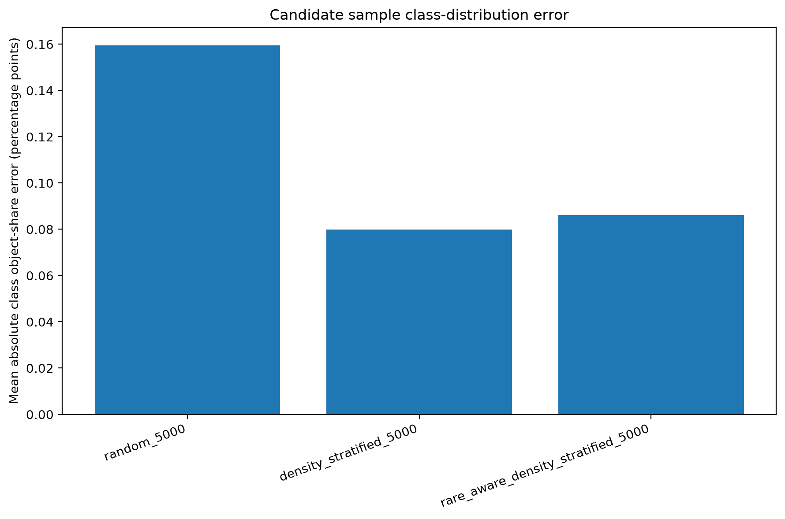
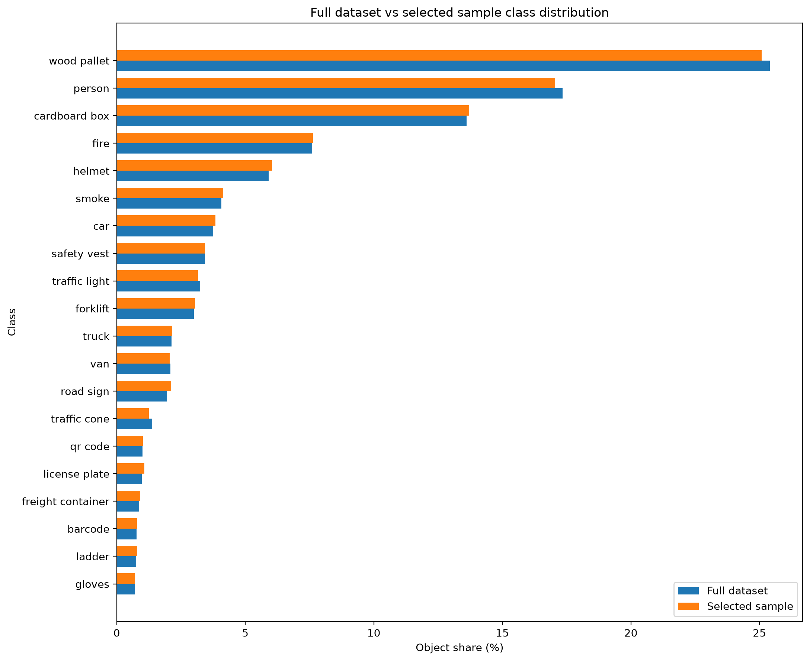
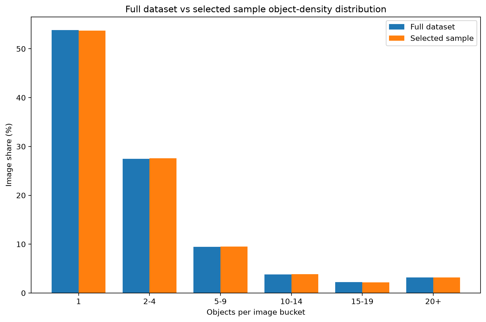
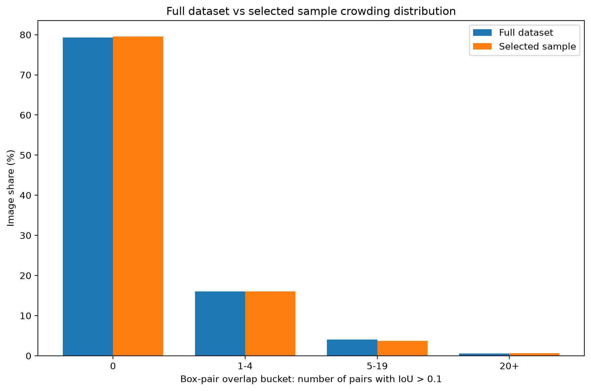

# Dataset Sampling and Validation

### Methodology

The design question for this analysis is how to create a representative working subset of the warehouse logistics dataset without distorting the data conditions that matter for later system design. The full dataset contains 9,525 images, 36,721 labeled object instances, and 20 object classes. The analysis uses a minimum of 5,000 images, so the selected subset must be large enough for meaningful analysis while remaining computationally manageable for later NMS, augmentation, and hard-negative-mining experiments.

A simple random sample would satisfy the size requirement, but it would not explicitly protect the dataset structure that matters in a warehouse object-detection system. The warehouse logistics dataset is imbalanced, with frequent classes such as wood pallet, person, cardboard box, fire, and helmet, and much rarer classes such as gloves, ladder, barcode, freight container, license plate, and QR code. The dataset also contains a dense-image tail: although the median image has only one labeled object, some images contain many objects, with the maximum image containing 224 labeled objects.

For that reason, the analysis compared three candidate 5,000-image sampling strategies:

1. **Random sampling:** selects 5,000 images without explicit distribution controls.
2. **Density-stratified sampling:** preserves the full dataset’s object-count density buckets.
3. **Rare-aware density-stratified sampling:** preserves object-density structure while enforcing minimum image-count targets for the eight rarest object classes.

The selected strategy is **rare-aware density-stratified sampling**. The criteria for selecting this subset were:

* use at least 5,000 images;
* preserve the overall class distribution;
* preserve sparse, medium-density, and dense multi-object scenes;
* protect rare classes from being underrepresented;
* preserve crowded and overlapping scenes that are relevant to later NMS threshold analysis;
* use a fixed random seed for reproducibility.

The final selected sample contains 5,000 unique images, 19,196 labeled objects, and no duplicate image paths.

### Table 1: Candidate Sampling Strategy Comparison

| Sampling Strategy                  | Images | Total Objects | Mean Objects/Image | Class Share MAE (pp) | Density Share MAE (pp) | Min Rare-Class Image Retention (%) | Images >=10 Objects | Images >=20 Objects |
| ---------------------------------- | -----: | ------------: | -----------------: | -------------------: | ---------------------: | ---------------------------------: | ------------------: | ------------------: |
| Random 5000                        |  5,000 |        18,934 |              3.787 |               0.1594 |                 0.1926 |                              47.26 |                 456 |                 151 |
| Density-Stratified 5000            |  5,000 |        19,267 |              3.853 |               0.0799 |                 0.0046 |                              48.09 |                 463 |                 160 |
| Rare-Aware Density-Stratified 5000 |  5,000 |        19,196 |              3.839 |               0.0861 |                 0.0719 |                              52.57 |                 459 |                 158 |

**Table 1: Candidate sampling strategy comparison.** The table compares the three candidate 5,000-image sampling strategies using class-distribution error, density-distribution error, rare-class retention, and dense-image coverage.

**Interpretation and design impact.** Pure density-stratified sampling has the lowest class-distribution and density-distribution error, but it does not protect rare classes as well as the rare-aware strategy. The rare-aware density-stratified sample increases class share MAE only slightly, from 0.0799 to 0.0861 percentage points, while improving minimum rare-class image retention from 48.09% to 52.57%. This trade-off is justified because rare object classes can represent important operational or safety-relevant cases. A representative working subset should not only match the most common classes; it should also preserve enough rare-class examples for later threshold, augmentation, and failure analysis.

### Figure 1: Candidate Sample Class-Distribution Error

**Figure 1: Candidate sample class-distribution error.** This figure compares the mean absolute class-share error for each candidate 5,000-image sampling strategy.

**Interpretation and design impact.** Random sampling has the highest class-share error, while density-stratified and rare-aware density-stratified sampling both preserve class distribution more closely. The rare-aware strategy introduces only a small class-distribution cost while improving rare-class coverage, which supports selecting it as the working sample.

### Table 2: Full Dataset vs Selected Sample Summary

| Dataset                              | Images | Total Objects | Mean Objects/Image | Median Objects/Image | Max Objects/Image | Images >=10 Objects | Images >=20 Objects |
| ------------------------------------ | -----: | ------------: | -----------------: | -------------------: | ----------------: | ------------------: | ------------------: |
| Full Dataset                         |  9,525 |        36,721 |              3.855 |                  1.0 |               224 |                 881 |                 304 |
| Rare-Aware Density-Stratified Sample |  5,000 |        19,196 |              3.839 |                  1.0 |               224 |                 459 |                 158 |

**Table 2: Full dataset vs selected sample summary.** The table compares overall object-density statistics for the full dataset and the selected 5,000-image subset.

**Interpretation and design impact.** The selected sample closely preserves the full dataset’s object-density profile. The mean objects per image is 3.855 in the full dataset and 3.839 in the selected sample. The selected sample also preserves dense-image coverage: the full dataset has 881 images with at least 10 objects and 304 images with at least 20 objects, while the selected sample has 459 and 158, respectively. These values are close to proportional for a 5,000-image subset of a 9,525-image dataset. This matters because later detection behavior can differ between sparse scenes and dense multi-object scenes.

### Figure 2: Full Dataset vs Selected Sample Class Distribution

**Figure 2: Full dataset vs selected sample class distribution.** This figure compares the object-share percentage of each class in the full dataset and in the selected 5,000-image sample.

**Interpretation and design impact.** The selected sample closely follows the full dataset class distribution across all 20 object classes. The largest object-share differences are small: wood pallet differs by about -0.319 percentage points and person differs by about -0.296 percentage points. This indicates that the selected subset is not an artificial class-balanced dataset. Instead, it remains close to the original deployment-like distribution while still protecting rare classes. This is important because later model and threshold decisions should be based on data that resembles the full operating environment.

### Table 3: Rare-Class Coverage

| Class             | Full Image Count | Sample Image Count | Target Image Count | Sample Image Retention (%) | Object Share Difference (pp) |
| ----------------- | ---------------: | -----------------: | -----------------: | -------------------------: | ---------------------------: |
| barcode           |              272 |                143 |                143 |                      52.57 |                       0.0159 |
| freight container |              192 |                103 |                101 |                      53.65 |                       0.0561 |
| gloves            |              226 |                120 |                119 |                      53.10 |                       0.0009 |
| ladder            |              183 |                100 |                100 |                      54.64 |                       0.0427 |
| license plate     |              292 |                160 |                154 |                      54.79 |                       0.0955 |
| QR code           |              299 |                161 |                157 |                      53.85 |                       0.0058 |
| road sign         |              372 |                196 |                196 |                      52.69 |                       0.1543 |
| traffic cone      |              291 |                154 |                153 |                      52.92 |                      -0.1277 |

**Table 3: Rare-class coverage in the selected sample.** The table shows the eight rarest classes by object count, their full-dataset image counts, their selected-sample image counts, and the target image counts enforced by the rare-aware sampling strategy.

**Interpretation and design impact.** All rare-class targets were met. The minimum rare-class image retention was 52.57%, which closely matches the overall sampling fraction of 5,000 out of 9,525 images. This is important because a sample that preserves only the common classes would be misleading for downstream system design. In a warehouse setting, rare classes such as gloves, traffic cones, road signs, license plates, and freight containers may still affect safety, navigation, inventory tracking, or operational interpretation. The selected sample protects these classes without forcing an unrealistic distribution.

### Figure 3: Full Dataset vs Selected Sample Object-Density Distribution

**Figure 3: Full dataset vs selected sample object-density distribution.** This figure compares the share of images in each object-count bucket for the full dataset and selected sample.

**Interpretation and design impact.** The selected sample closely preserves the full dataset’s object-density structure. The sample retains nearly the same proportion of single-object images, medium-density images, and dense images. This matters because dense scenes are more challenging for object detection than sparse scenes. They can increase the risk of missed objects, duplicate detections, and false suppression during NMS. A sampling strategy that ignored density could produce misleading later results, especially for NMS threshold selection.

### Figure 4: Full Dataset vs Selected Sample Crowding Distribution

**Figure 4: Full dataset vs selected sample crowding distribution.** This figure compares the full dataset and selected sample using ground-truth box-pair overlap buckets. The buckets are based on how many ground-truth box pairs in an image have IoU greater than 0.1.

**Interpretation and design impact.** Object count alone does not fully describe scene difficulty. Twenty objects spread across an image are not the same as twenty objects clustered or overlapping. Because NMS-threshold analysis examines NMS threshold behavior, the sample should preserve crowded and overlapping scenes, not only class counts. The selected sample preserves the crowding distribution closely: images with no overlapping ground-truth box pairs are 79.33% of the full dataset and 79.58% of the selected sample, while the most crowded bucket, images with 20 or more overlapping pairs, is 0.57% of the full dataset and 0.64% of the selected sample.

### Table 4: Overlap and Crowding Summary

| Dataset                              | Images | Mean Box Pairs/Image | Mean Max Pairwise IoU | Mean Pairs IoU > 0.1 | Images with Any IoU > 0.1 | Images with Any IoU > 0.3 | Images with Any IoU > 0.5 | Images with 20+ IoU>0.1 Pairs |
| ------------------------------------ | -----: | -------------------: | --------------------: | -------------------: | ------------------------: | ------------------------: | ------------------------: | ----------------------------: |
| Full Dataset                         |  9,525 |               38.316 |                0.0760 |                0.852 |                     1,969 |                       932 |                       367 |                            54 |
| Rare-Aware Density-Stratified Sample |  5,000 |               40.317 |                0.0756 |                0.889 |                     1,021 |                       486 |                       200 |                            32 |

**Table 4: Overlap and crowding summary.** The table compares full-dataset and selected-sample overlap statistics using pairwise ground-truth bounding-box IoU.

**Interpretation and design impact.** The selected sample preserves NMS-relevant crowding structure. The full dataset has a mean max pairwise IoU of 0.0760, while the selected sample has 0.0756. The number of images with any ground-truth overlap above IoU 0.1 is also close to proportional. The selected sample slightly over-preserves the most crowded cases, with 32 images in the 20+ overlap-pair bucket compared with 54 in the full dataset. This is acceptable because crowded scenes are especially relevant for later NMS threshold analysis. This overlap validation is not model evaluation; it is a dataset representativeness check using ground-truth box structure.

## Conclusion

The selected dataset for the remaining analyses is the **5,000-image rare-aware density-stratified sample**. This sampling strategy is valid because it preserves the dataset properties most relevant to warehouse object-detection design while remaining computationally manageable.

The selected sample preserves the full dataset’s class distribution, protects rare classes, maintains sparse and dense scene structure, and preserves ground-truth box-crowding patterns relevant to NMS. This makes it a stronger design choice than simple random sampling. It also improves rare-class retention compared with pure density stratification while introducing only a small distribution cost.

The main limitation is that the selected sample is still a working subset, not a permanent replacement for full-dataset validation. When final deployment claims are made, full-dataset validation should be used when computationally feasible. In addition, the crowding analysis uses ground-truth overlap as a proxy for NMS difficulty; actual duplicate-detection behavior must still be evaluated with model predictions in NMS-threshold analysis.
