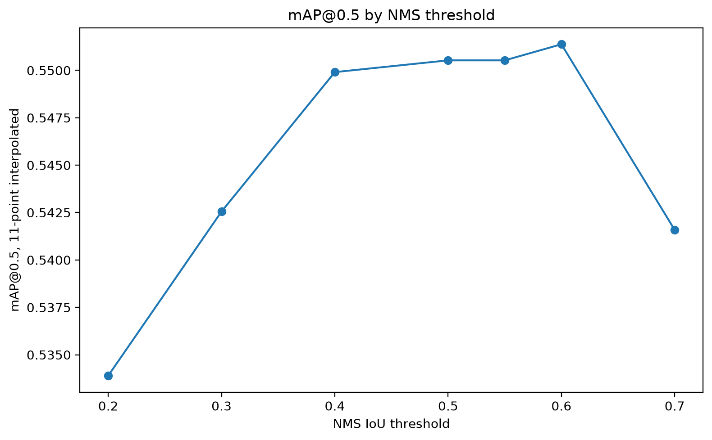
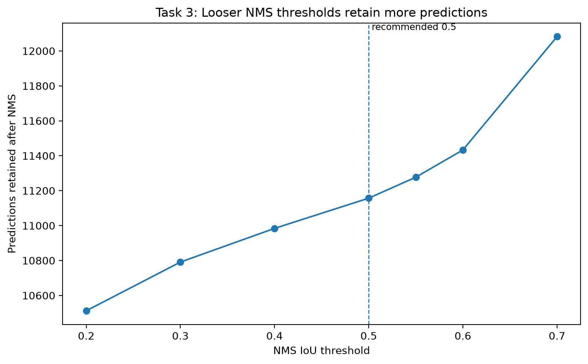
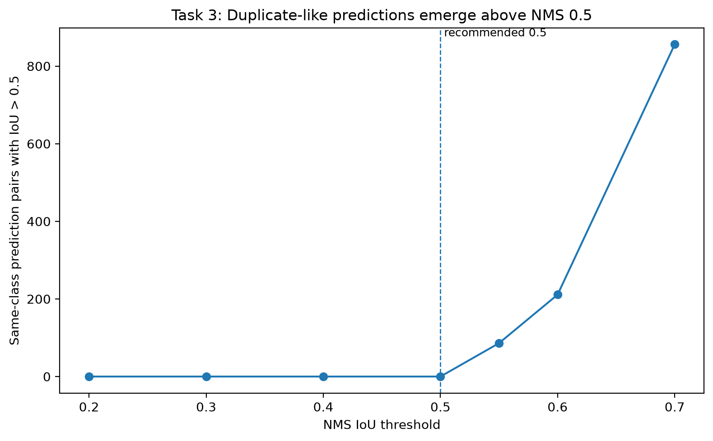

# NMS Threshold Analysis

### Methodology

The design question for this analysis is which NMS IoU threshold should be used with the best-performing detector selected in model-selection analysis. Since Model 2 achieved the stronger overall and per-class performance, NMS-threshold analysis uses Model 2 as the fixed baseline detector. The experiment uses the 5,000-image rare-aware density-stratified sample selected in dataset-sampling analysis.

The purpose of this analysis is to isolate the effect of the NMS module. For that reason, the model, dataset, score threshold, and evaluation method were held constant. Model 2 was evaluated with a fixed score threshold of 0.5 and mAP@0.5 using the implemented `metrics.py` pipeline. The only parameter varied was the NMS IoU threshold.

The NMS thresholds tested were:

* 0.20
* 0.30
* 0.40
* 0.50
* 0.55
* 0.60
* 0.70

The experiment first ran Model 2 inference once on the selected 5,000-image sample and saved the pre-NMS detections. The implemented NMS module was then applied repeatedly to the same raw detections at each threshold. This avoids rerunning model inference for each threshold and keeps the experiment focused on the NMS parameter.

The evaluation considers three kinds of evidence:

* aggregate mAP@0.5;
* number of predictions retained after NMS;
* duplicate-like detections, defined as same-class post-NMS prediction pairs with IoU greater than 0.5.

The duplicate-like detection count is not an AP metric. It is a diagnostic used to measure whether a looser NMS threshold leaves redundant overlapping predictions in the final output.

### Table 7: NMS Threshold Sweep Summary

| NMS Threshold | mAP@0.5 | Predictions After NMS | Duplicate-Like Pairs: IoU > 0.5 | Images with Duplicate-Like Pairs |
| ------------: | ------: | --------------------: | ------------------------------: | -------------------------------: |
|          0.20 |  0.5339 |                10,512 |                               0 |                                0 |
|          0.30 |  0.5426 |                10,791 |                               0 |                                0 |
|          0.40 |  0.5499 |                10,984 |                               0 |                                0 |
|          0.50 |  0.5505 |                11,157 |                               0 |                                0 |
|          0.55 |  0.5505 |                11,277 |                              86 |                               78 |
|          0.60 |  0.5514 |                11,433 |                             211 |                              188 |
|          0.70 |  0.5416 |                12,082 |                             856 |                              623 |

**Table 7: NMS threshold sweep summary.** The table compares mAP@0.5, prediction count, and duplicate-like detection behavior across NMS IoU thresholds.

**Interpretation and design impact.** The results show the main NMS trade-off. Very low thresholds are too aggressive: at 0.20 and 0.30, fewer predictions survive NMS and mAP is lower. Performance improves as the threshold rises toward 0.50. However, moving above 0.50 begins to create duplicate-like detections. Threshold 0.55 gives effectively the same mAP as 0.50, but adds 120 more predictions and creates 86 duplicate-like pairs. Threshold 0.60 produces the highest aggregate mAP, but its gain over 0.50 is only about 0.00085 while creating 211 duplicate-like pairs. Threshold 0.70 is clearly too loose because mAP drops while duplicate-like detections increase sharply.

### Figure 6: mAP@0.5 Across NMS IoU Thresholds

**Figure 6: mAP@0.5 across NMS IoU thresholds.** This figure shows how aggregate detection performance changes as the NMS IoU threshold is varied.

**Interpretation and design impact.** The mAP curve rises from 0.20 through 0.50 and then flattens. Threshold 0.60 is the numerical peak, but the improvement over 0.50 is extremely small. This means the threshold decision should not be based on aggregate mAP alone. The more important design question is whether the small mAP gain at looser thresholds justifies the additional predictions and duplicate-like detections. The remaining evidence shows that it does not.

### Figure 7: Post-NMS Prediction Count Across Thresholds

**Figure 7: Post-NMS prediction count across NMS thresholds.** This figure shows how many detections remain after NMS at each threshold.

**Interpretation and design impact.** Prediction count increases as the NMS threshold becomes looser. This is expected because higher NMS thresholds allow more overlapping boxes to survive suppression. A higher prediction count is not automatically harmful if the additional boxes are valid detections, but in a warehouse perception system it can increase downstream review burden, duplicate detections, and noisy object states. This is especially important for systems where detection outputs may be consumed by monitoring tools, robots, or human operators.

### Figure 8: Duplicate-Like Prediction Pairs Across Thresholds

**Figure 8: Duplicate-like prediction pairs across NMS thresholds.** This figure counts same-class post-NMS prediction pairs with IoU greater than 0.5. It is used as a diagnostic for redundant overlapping detections.

**Interpretation and design impact.** This figure gives the strongest evidence against choosing a threshold above 0.50. Thresholds from 0.20 through 0.50 produce no duplicate-like prediction pairs under this diagnostic. Duplicate-like detections begin at 0.55 and increase rapidly at 0.60 and 0.70. This means the small aggregate mAP gain at 0.60 comes with a clear cost: the final detector output becomes less clean. For deployment, this matters because duplicate boxes can make the system appear to detect more objects than are actually present, confuse downstream logic, or create unnecessary operator attention.

### Table 8: Focused Threshold Decision Comparison

| NMS Threshold | mAP@0.5 | mAP Change vs 0.50 | Predictions After NMS | Prediction Change vs 0.50 | Duplicate-Like Pairs: IoU > 0.5 | Images with Duplicate-Like Pairs |
| ------------: | ------: | -----------------: | --------------------: | ------------------------: | ------------------------------: | -------------------------------: |
|          0.50 |  0.5505 |             0.0000 |                11,157 |                         0 |                               0 |                                0 |
|          0.55 |  0.5505 |            -0.0000 |                11,277 |                       120 |                              86 |                               78 |
|          0.60 |  0.5514 |             0.0008 |                11,433 |                       276 |                             211 |                              188 |
|          0.70 |  0.5416 |            -0.0089 |                12,082 |                       925 |                             856 |                              623 |

**Table 8: Focused threshold decision comparison.** The table compares the main candidate thresholds near the final decision boundary, using 0.50 as the reference point.

**Interpretation and design impact.** Threshold 0.50 is the strongest operating point. Threshold 0.55 gives no meaningful mAP improvement, but creates duplicate-like predictions. Threshold 0.60 gives the highest mAP, but the gain over 0.50 is only 0.0008, while it adds 276 predictions and 211 duplicate-like pairs. Threshold 0.70 is worse on both accuracy and duplicate behavior. Therefore, 0.50 gives the best balance between accuracy and clean post-processing.

### Table 9: Per-Class Sensitivity Near the Decision Boundary

| Comparison   | Classes Improved | Classes Unchanged | Classes Worsened |
| ------------ | ---------------: | ----------------: | ---------------: |
| 0.55 vs 0.50 |                4 |                 0 |               16 |
| 0.60 vs 0.50 |                2 |                 0 |               18 |

**Table 9: Per-class sensitivity around the NMS decision boundary.** The table counts how many classes improved or worsened when moving from NMS 0.50 to looser thresholds.

**Interpretation and design impact.** The class-level evidence supports rejecting the looser thresholds. Threshold 0.55 improves only four classes and worsens sixteen. Threshold 0.60 improves only two classes and worsens eighteen. The aggregate mAP peak at 0.60 is mainly driven by a large gain in safety vest AP, not by broad class-level improvement. A deployment threshold should not be chosen only because one class raises the aggregate average slightly while most classes decline. This makes 0.50 the more stable system-level choice.

### Table 10: Crowded-Image Subset Check

| Subset              | Images | Ground Truth Objects | NMS Threshold | mAP@0.5 | Predictions After NMS | Duplicate-Like Pairs: IoU > 0.5 | Images with Duplicate-Like Pairs |
| ------------------- | -----: | -------------------: | ------------: | ------: | --------------------: | ------------------------------: | -------------------------------: |
| All selected images |  5,000 |               19,196 |          0.50 |  0.5505 |                11,157 |                               0 |                                0 |
| Crowded images      |  1,021 |               11,411 |          0.50 |  0.3435 |                 5,953 |                               0 |                                0 |
| All selected images |  5,000 |               19,196 |          0.55 |  0.5505 |                11,277 |                              86 |                               78 |
| Crowded images      |  1,021 |               11,411 |          0.55 |  0.3435 |                 6,037 |                              50 |                               43 |
| All selected images |  5,000 |               19,196 |          0.60 |  0.5514 |                11,433 |                             211 |                              188 |
| Crowded images      |  1,021 |               11,411 |          0.60 |  0.3469 |                 6,130 |                             114 |                               92 |
| All selected images |  5,000 |               19,196 |          0.70 |  0.5416 |                12,082 |                             856 |                              623 |
| Crowded images      |  1,021 |               11,411 |          0.70 |  0.3464 |                 6,406 |                             341 |                              232 |

**Table 10: Crowded-image subset check.** The crowded subset contains selected-sample images where at least two ground-truth boxes overlap slightly, defined as a ground-truth box-pair IoU greater than 0.1. This subset is used to check NMS behavior on images where real objects are spatially close and suppression errors are more likely.

**Interpretation and design impact.** The crowded-image subset has lower mAP than the full selected sample, which is expected because crowded scenes are more difficult. Looser thresholds slightly improve mAP on crowded images, but they also introduce duplicate-like predictions. At 0.55, crowded-image mAP is essentially unchanged compared with 0.50, but duplicate-like pairs appear. At 0.60, crowded-image mAP improves from 0.3435 to 0.3469, but duplicate-like pairs increase to 114 in the crowded subset. This confirms the same trade-off seen in the full sample: looser NMS can preserve more boxes in crowded scenes, but it also makes the output noisier.

## Conclusion

The recommended NMS IoU threshold is **0.50**.

Although threshold 0.60 produces the highest aggregate mAP@0.5, the gain over 0.50 is only about 0.0008. That gain is too small to justify the duplicate-like detections introduced by looser NMS. Threshold 0.55 also fails to justify moving above 0.50 because it produces effectively the same mAP as 0.50 while creating duplicate-like prediction pairs.

Threshold 0.50 gives the best engineering trade-off. It provides near-maximum mAP, keeps the post-NMS output cleaner, avoids duplicate-like same-class prediction pairs, and remains defensible on crowded images where NMS suppression risk is highest. This continues the design logic from model-selection analysis and dataset-sampling analysis: Model 2 is the stronger detector, the selected sample preserves NMS-relevant crowded scenes, and NMS 0.50 gives the cleanest threshold configuration for that pipeline.
