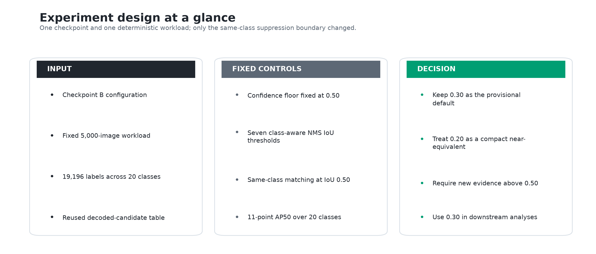
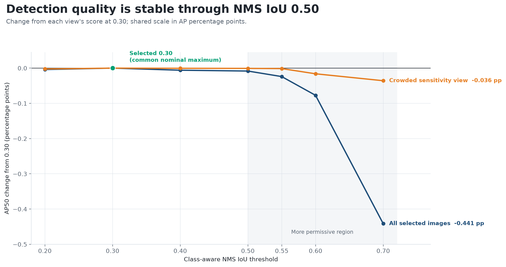
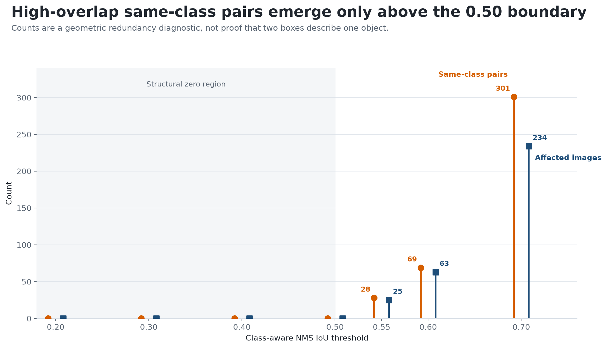
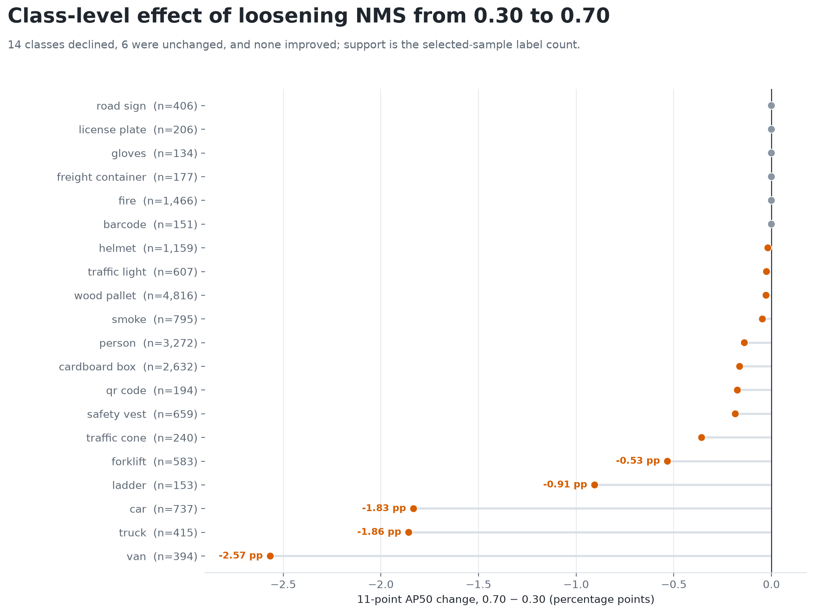

# Experiment 03 — Class-Aware NMS Sensitivity and Operating-Point Decision

## Decision

This experiment retained **class-aware NMS IoU `0.30` as the provisional
default** for the fixed Checkpoint B pipeline. On the deterministic 5,000-image
workload, `0.30` produced the highest recorded confidence-threshold-constrained
11-point AP50 (`0.401573`) while emitting 7,727 predictions. The same threshold
also produced the highest recorded score in the 1,021-image crowded sensitivity
view (`0.244778`).

The evidence does not identify a uniquely superior universal threshold. Scores
were effectively flat from `0.20` through `0.50`: the complete-sample range was
only `0.000083`, or `0.0083` percentage points. Threshold `0.20` is therefore a
valid compact near-equivalent, emitting 42 fewer predictions than `0.30` for a
score difference of only `0.000039` (`0.0039` percentage points). The decision
favored `0.30` because it was the common nominal maximum across both evaluation
views and retained the nominal NMS value used during checkpoint comparison.

The clearer boundary was above `0.50`. At `0.70`, the detector emitted 305 more
predictions than at `0.30`, its score declined by `0.004414` (`0.4414`
percentage points), and 301 high-overlap same-class pairs remained. This is a
conditional operating-point decision for Checkpoint B, the selected workload,
the fixed confidence policy, and the stated metric—not a claim that `0.30` is
optimal for every detector or deployment.

*Figure 1. INPUT / CONTROLLED / DECISION summary of the experiment.
The checkpoint, sample, decoded candidates, score policy, matching rule, and AP
definition remained fixed while only the class-aware NMS IoU boundary changed.*

**Interpretation.** This design isolates a post-processing choice. It also
makes the decision boundary explicit: retain `0.30`, recognize `0.20` as a
compact alternative, and require new evidence before loosening NMS above
`0.50`.

## Why this experiment was necessary

Experiment 01 selected Checkpoint B over Checkpoint A. That comparison used all
9,525 images, a low score floor of `0.001`, 101-point AP50, and a provisional
NMS setting of `0.30`. Experiment 02 then produced the deterministic
rare-aware, density-stratified 5,000-image workload used here and identified a
1,021-image crowded sensitivity slice.

Experiment 03 freezes both upstream decisions and varies only NMS. The sequence
is best understood as staged coordinate selection: Experiment 01 chose the
checkpoint conditional on `0.30`; this experiment then tests and retains
`0.30` conditional on Checkpoint B. It does not retroactively convert the two
stages into a joint checkpoint-and-threshold optimization.

| Dependency | Fixed input used here | Decision boundary |
|---|---|---|
| Experiment 01 | Checkpoint B (`model2`) | Checkpoint identity did not change during the sweep |
| Experiment 02 | 5,000 images, 19,196 labels, 20 classes | Every threshold received the same ordered workload |
| Experiment 02 | 1,021 crowded images, 11,411 labels | Used as a sensitivity view, not a second training or tuning set |
| Experiment 03 | Seven NMS IoU values from `0.20` to `0.70` | Select a conditional post-processing operating point |

*Table 1. The experiment consumes the selected checkpoint and
evaluation workload as fixed inputs; it makes only the NMS decision.*

**Interpretation.** Keeping those boundaries separate prevents checkpoint,
sampling, and suppression effects from being conflated. It also explains why
the absolute AP50 values in Experiments 01 and 03 are not numerically
comparable.

## Evaluation design

For each prediction, combined confidence is objectness multiplied by the
predicted-class probability. Candidates first had to pass objectness strictly
greater than `0.50`; post-processing then required combined confidence at least
`0.50`. Eligible detections were ranked by combined confidence and suppressed
only against other predictions of the same class. A prediction counted as a
true positive only when it matched one unused ground-truth object of the same
class at IoU at least `0.50`.

The reported metric is an equal-weight mean across 20 class AP values. Each
class uses 11-point interpolated AP at match IoU `0.50`. Because detections below
combined confidence `0.50` were removed before the precision–recall curve was
calculated, this is **confidence-threshold-constrained 11-point AP50**. It is
neither COCO mAP nor the low-floor 101-point AP50 reported in Experiment 01.

| Factor | Locked setting |
|---|---:|
| Checkpoint | B (`model2`) |
| Complete evaluation view | 5,000 images; 19,196 labels; 20 classes |
| Crowded sensitivity view | 1,021 images; 11,411 labels |
| Candidate gate | Objectness `> 0.50` |
| Eligibility and ranking | Combined confidence `>= 0.50` |
| Suppression | Same predicted class; IoU in `{0.20, 0.30, 0.40, 0.50, 0.55, 0.60, 0.70}` |
| Evaluation matching | Same class; one-to-one; IoU `>= 0.50` |
| Primary score | Equal-weight 20-class, 11-point AP50 |
| Redundancy diagnostic | Retained same-class pair IoU `> 0.50` |

*Table 2. All inference, filtering, matching, and aggregation policy
was held constant apart from the swept NMS IoU threshold.*

**Interpretation.** The paired design reuses one decoded-candidate workload, so
differences among rows reflect suppression and its downstream matching effects,
not repeated network execution. The metric definition must travel with every
reported value because changing the confidence floor or AP interpolation would
change the number.

## Aggregate quality and output trade-off

| NMS IoU | 11-point AP50 | Retained predictions | High-overlap pairs | Affected images |
|---:|---:|---:|---:|---:|
| 0.20 | 0.401534 | 7,685 | 0 | 0 |
| **0.30** | **0.401573** | **7,727** | **0** | **0** |
| 0.40 | 0.401513 | 7,744 | 0 | 0 |
| 0.50 | 0.401490 | 7,758 | 0 | 0 |
| 0.55 | 0.401333 | 7,785 | 28 | 25 |
| 0.60 | 0.400801 | 7,824 | 69 | 63 |
| 0.70 | 0.397159 | 8,032 | 301 | 234 |

*Table 3. Quality, output volume, and geometric-redundancy evidence
for all seven thresholds on the same 5,000 images.*

**Interpretation.** `0.30` is the nominal maximum, but the practical result is
a stable region through `0.50`, not a sharply peaked optimum. Settings `0.40`
and above are dominated by `0.30` on the two measured objectives: they retain
more predictions while producing no higher AP50. Thresholds `0.20` and `0.30`
form the tested quality/output frontier because neither is better on both
objectives.

*Figure 2. Change in full-sample and crowded-view AP50 relative to
their respective scores at `0.30`, shown on one percentage-point scale.*

**Interpretation.** Both views are nearly flat through `0.50`. The full-sample
decline becomes material as suppression is loosened to `0.60` and `0.70`; the
crowded view moves less, but it also has a different class mix and therefore
cannot be compared to the full view as a controlled estimate of “crowding
difficulty.”

*Figure 3. Change in AP50 versus change in retained prediction count,
both relative to `0.30`. Higher is better for quality; farther left is more
compact.*

**Interpretation.** `0.20` gives up only `0.0039` AP percentage points while
removing 42 predictions, so it remains a defensible compact option. `0.30`
retains the highest measured score. The other tested points add output without
improving quality, and `0.70` is the clearest unfavorable trade-off.

## Redundancy guardrail

*Figure 4. Retained same-class prediction pairs with mutual IoU
strictly greater than `0.50`, plus the number of images containing at least one
such pair.*

**Interpretation.** The zero region through NMS `0.50` is structural: a
same-class pair above the `0.50` diagnostic boundary cannot survive when NMS
suppresses overlaps above a boundary no greater than `0.50`. It is not
independent evidence that every retained box is correct. Above `0.50`, the
diagnostic exposes a rapidly growing geometric-redundancy risk—28 pairs at
`0.55`, 69 at `0.60`, and 301 at `0.70`.

A high-overlap pair is not automatically a duplicate error. Two real,
same-class objects may overlap. The measure is therefore a review-oriented
guardrail, not an annotation of physical identity. Likewise, the observed
retained-count sequence is monotonic across the seven settings, but greedy NMS
does not guarantee that each looser retained set is a strict superset of the
previous one.

## Class-level impact

*Figure 5. Per-class 11-point AP50 change when NMS is loosened from
`0.30` to `0.70`; support is the selected-sample ground-truth count.*

**Interpretation.** Fourteen classes declined, six were unchanged, and none
improved. The aggregate reduction is not evenly distributed: vehicle classes
account for three of the five largest losses. Support labels distinguish the
size of each evaluation population from the magnitude of its point estimate.

| Class | Ground-truth support | AP50 at 0.30 | AP50 at 0.70 | Change (percentage points) |
|---|---:|---:|---:|---:|
| Van | 394 | 0.709017 | 0.683355 | −2.5662 |
| Truck | 415 | 0.592886 | 0.574314 | −1.8573 |
| Car | 737 | 0.443335 | 0.425010 | −1.8325 |
| Ladder | 153 | 0.173554 | 0.164502 | −0.9052 |
| Forklift | 583 | 0.531477 | 0.526154 | −0.5323 |

*Table 4. The five most negative per-class AP50 changes under the
most permissive tested setting.*

**Interpretation.** Every listed class retains more predictions at `0.70` yet
scores lower. The additional boxes therefore do not translate into better
ranked matches under this metric. This is consistent with lower-quality or
redundant predictions entering the evaluated output, although the aggregate
tables alone do not assign an error cause to each box.

## Engineering decision and downstream impact

The predeclared decision rule is explicit and lexicographic:

1. Maximize threshold-constrained 11-point AP50.
2. If measured AP50 ties, minimize retained prediction count.
3. If both values tie, choose the lower IoU threshold.

The verifier requires exactly one row for each of the seven declared thresholds
in both decision tables, checks that their retained-prediction counts agree,
recomputes the ranking, and compares the selected threshold and metrics with
`operating_point.json`. This rule selects `0.30` because it has the highest
measured AP50. Duplicate-like-pair counts and the crowded view are supporting
diagnostics rather than hidden selection criteria.

Settings above `0.50` are operationally unattractive in this evidence because
they add output and high-overlap pairs without improving measured quality.
`0.20` remains a compact near-equivalent only if a measured downstream cost
justifies the 42-prediction reduction; the current experiment did not measure
that cost.

This contract carries `0.30` into Experiment 04 so controlled input-shift effects are
measured against a fixed suppression policy, and into Experiment 05 so error
review queues describe the same runtime output. A new checkpoint, confidence
threshold, camera domain, or false-positive/false-negative cost model should
trigger a joint operating-point reevaluation rather than inherit `0.30`
uncritically.

## Limitations

- The sweep evaluates one checkpoint on one deterministic selected workload;
  it does not establish out-of-domain generalization.
- Checkpoint training-data provenance is incomplete, so overlap between its
  training data and the 9,525-image corpus is unknown.
- No untouched confirmatory set or uncertainty interval was used. Differences
  near the nominal maximum are too small to establish a unique optimum.
- Objectness and combined-confidence thresholds were fixed at `0.50`. Joint
  confidence/NMS tuning may select a different operating point.
- The crowded slice is defined by any-class ground-truth overlap and has a
  different class mix. It contains no `barcode` labels, while the reported mAP
  still averages the fixed 20-class vocabulary. Its absolute score is therefore
  not directly comparable with the complete-sample score.
- The high-overlap-pair statistic measures geometry, not confirmed duplicate
  identity.
- Retained prediction count is a workload proxy, not a latency measurement; no
  end-to-end timing was collected in this experiment.
- The retained result tables support the operating-point comparison but do not
  substitute for rerunning inference when the checkpoint, candidate policy,
  dependency environment, or source workload changes.

## Implementation and reproducibility

| Responsibility | Reference |
|---|---|
| Candidate validation and threshold sweep | `experiments/scripts/03_nms_thresholding/01_sweep_nms_thresholds.py` |
| Combined-confidence calculation and class-aware suppression | `detector_service/modules/inference/nms.py` |
| IoU, one-to-one matching, precision–recall, and AP | `detector_service/modules/utils/metrics.py` |

*Table 5. Code paths connecting the experimental policy to the
runtime post-processing and evaluation implementation.*

**Interpretation.** The same NMS implementation supplies the runtime behavior
and the experiment, while metric code remains separate from suppression. This
keeps the operating policy aligned with the service without allowing the
evaluation metric to influence which detections are retained.

`experiments/scripts/03_nms_thresholding/01_sweep_nms_thresholds.py` performs the controlled sweep
over the seven declared IoU thresholds using Checkpoint B, the Experiment 02
workload, the fixed confidence policy, and the ordered 20-class vocabulary.
The run validates the expected complete and crowded-slice populations,
reconciles per-class and aggregate counts, and recomputes the declared
lexicographic operating-point rule. Full inference requires the external
dataset, checkpoint, configuration, and class vocabulary described by the
repository data policy.
