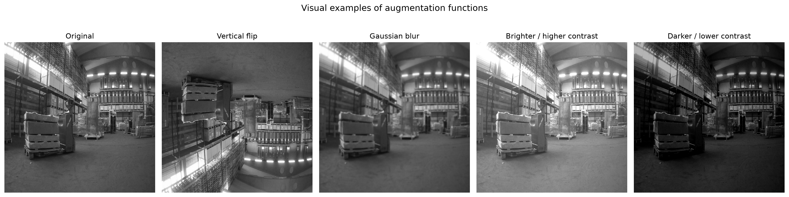
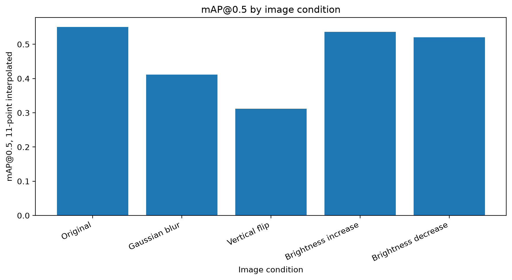
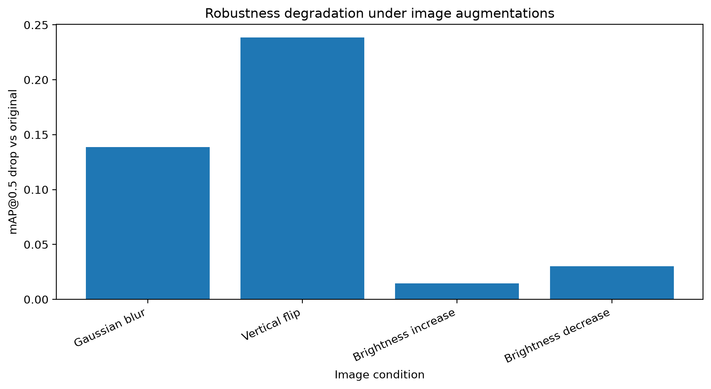
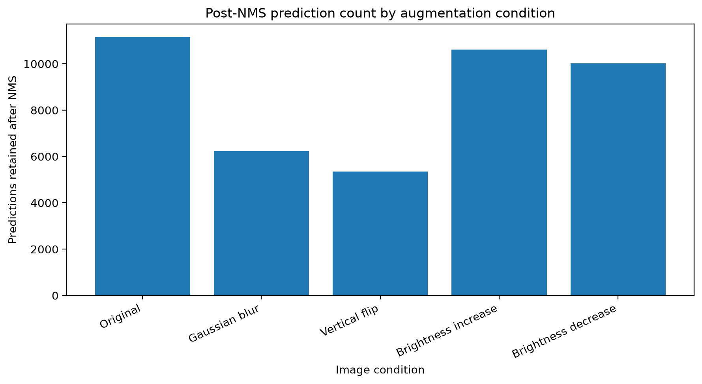
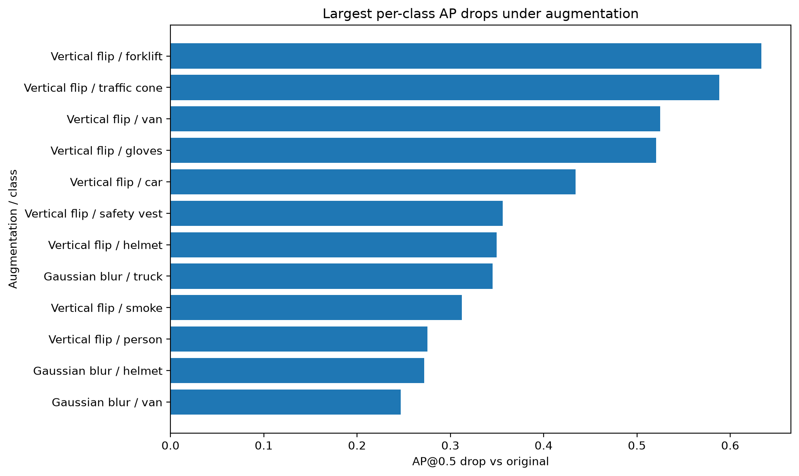

# Augmentation Robustness Analysis

### Methodology

The design question for this analysis is how robust the selected Warehouse Object Detection detector is to image transformations that may appear during augmentation or deployment-like visual variation. The analysis evaluates the effects of Gaussian blur, vertical flips, and brightness adjustments on the best-performing model from model-selection analysis. Since Model 2 was selected as the baseline detector, augmentation-robustness analysis evaluates Model 2 under each transformed image condition.

The experiment uses the 5,000-image rare-aware density-stratified sample selected in dataset-sampling analysis. The detector configuration is held constant so that the experiment isolates augmentation impact rather than mixing augmentation effects with model or threshold changes. The fixed settings are:

* Model: Model 2
* Dataset: dataset-sampling analysis selected 5,000-image sample
* Score threshold: 0.5
* NMS IoU threshold: 0.50, selected in NMS-threshold analysis
* Evaluation IoU threshold: 0.5
* Metric: mAP@0.5 using 11-point interpolation through the implemented `metrics.py` pipeline

The tested image conditions were:

* Original images
* Gaussian blur with kernel size 9
* Vertical flip
* Brightness increase, using alpha 1.15 and beta 35
* Brightness decrease, using alpha 0.85 and beta -35

For Gaussian blur and brightness changes, ground-truth boxes remain unchanged because object locations do not move. For vertical flip, the ground-truth boxes are also vertically flipped before evaluation. This is necessary because otherwise the flipped image and original labels would no longer describe the same object locations.

### Table 1: Augmentation Impact Summary

| Image Condition     | mAP@0.5 | mAP Change vs Original | Percent Change vs Original | Ground Truth Objects | Predictions After NMS | Prediction Change vs Original |
| ------------------- | ------: | ---------------------: | -------------------------: | -------------------: | --------------------: | ----------------------------: |
| Original            |  0.5505 |                 0.0000 |                      0.00% |               19,196 |                11,157 |                             0 |
| Gaussian blur       |  0.4118 |                -0.1387 |                    -25.20% |               19,196 |                 6,230 |                        -4,927 |
| Vertical flip       |  0.3120 |                -0.2385 |                    -43.32% |               19,196 |                 5,355 |                        -5,802 |
| Brightness increase |  0.5359 |                -0.0146 |                     -2.65% |               19,196 |                10,622 |                          -535 |
| Brightness decrease |  0.5205 |                -0.0300 |                     -5.45% |               19,196 |                10,024 |                        -1,133 |

**Table 1: Augmentation impact summary.** The table compares Model 2 performance across the original and transformed image conditions while holding the model, dataset, score threshold, NMS threshold, and evaluation method constant.

**Interpretation and design impact.** The results show that Model 2 is not equally robust to all transformations. Vertical flip causes the largest degradation, reducing mAP@0.5 from 0.5505 to 0.3120, a 43.32% drop. Gaussian blur also causes a substantial performance decline, reducing mAP@0.5 to 0.4118, a 25.20% drop. Brightness changes are much less damaging: brightness increase reduces mAP by only 2.65%, while brightness decrease reduces mAP by 5.45%. The prediction counts follow the same pattern. Gaussian blur and vertical flip sharply reduce the number of detections retained after NMS, while brightness changes reduce prediction count only moderately.

### Figure 1: Visual Examples of Augmentation Functions

**Figure 1: Visual examples of Warehouse Object Detection augmentation functions.** This figure shows the original image and the transformed versions used in augmentation-robustness analysis: vertical flip, Gaussian blur, brightness increase, and brightness decrease.

**Interpretation and design impact.** The visual examples confirm that the implemented augmentation functions produce the intended transformations. Gaussian blur reduces image sharpness and weakens edges and texture details. Brightness adjustments change illumination while preserving object locations. Vertical flip changes the geometry and orientation of the entire scene. This matters because not all augmentations are equally realistic for a warehouse camera. Lighting changes and blur can plausibly occur in deployment, but vertical flipping may represent a less realistic transformation unless cameras are mounted or processed in unusual orientations.

### Figure 2: Model 2 mAP@0.5 by Image Condition

**Figure 2: Model 2 mAP@0.5 by image condition.** This figure compares absolute mAP@0.5 across the original and augmented image conditions.

**Interpretation and design impact.** The original images produce the highest mAP. Brightness increase and brightness decrease remain relatively close to the original condition, while Gaussian blur and vertical flip produce much lower mAP. This indicates that Model 2 is more robust to moderate illumination changes than to blur or geometric inversion. The result is important for deployment planning because warehouse systems may experience lighting changes, motion blur, defocus, camera noise, or unusual camera orientations. These transformations do not have equal impact on model reliability.

### Figure 3: mAP@0.5 Drop vs Original

**Figure 3: mAP@0.5 drop vs original under image augmentations.** This figure shows performance degradation as a positive mAP drop from the original-image baseline.

**Interpretation and design impact.** Expressing the result as a positive drop makes the robustness ranking clear. Vertical flip produces the largest mAP loss, followed by Gaussian blur. Brightness decrease is more damaging than brightness increase, but both brightness conditions are much less damaging than blur or vertical flip. This suggests that brightness augmentation is comparatively safe and realistic, while blur should be treated as a serious robustness concern and vertical flip should be used cautiously.

### Figure 4: Post-NMS Prediction Count by Image Condition

**Figure 4: Post-NMS prediction count by image condition.** This figure compares the number of detections retained after applying the fixed NMS threshold of 0.50.

**Interpretation and design impact.** Gaussian blur and vertical flip sharply reduce the number of predictions retained after NMS. The original condition produces 11,157 post-NMS predictions, while Gaussian blur produces 6,230 and vertical flip produces 5,355. This means the model is not only making less accurate detections under these transformations; it is also producing fewer confident detections that survive post-processing. Brightness changes reduce the prediction count less severely, which matches their smaller mAP decline.

### Table 2: Largest Per-Class AP Drops Under Augmentation

| Image Condition | Class        | Ground Truth Count | Prediction Count | Original AP@0.5 | AP@0.5 Under Augmentation | AP Drop vs Original |
| --------------- | ------------ | -----------------: | ---------------: | --------------: | ------------------------: | ------------------: |
| Vertical flip   | forklift     |                583 |               33 |          0.7150 |                    0.0816 |              0.6334 |
| Vertical flip   | traffic cone |                240 |               23 |          0.7281 |                    0.1400 |              0.5881 |
| Vertical flip   | van          |                394 |              117 |          0.7896 |                    0.2648 |              0.5247 |
| Vertical flip   | gloves       |                134 |               37 |          0.6404 |                    0.1198 |              0.5206 |
| Vertical flip   | car          |                737 |              103 |          0.6322 |                    0.1979 |              0.4343 |
| Vertical flip   | safety vest  |                659 |              135 |          0.5308 |                    0.1748 |              0.3560 |
| Vertical flip   | helmet       |              1,159 |               46 |          0.4994 |                    0.1496 |              0.3498 |
| Gaussian blur   | truck        |                415 |              203 |          0.7607 |                    0.4152 |              0.3455 |
| Vertical flip   | smoke        |                795 |               28 |          0.3980 |                    0.0859 |              0.3121 |
| Vertical flip   | person       |              3,272 |              580 |          0.5868 |                    0.3111 |              0.2756 |
| Gaussian blur   | helmet       |              1,159 |              139 |          0.4994 |                    0.2276 |              0.2718 |
| Gaussian blur   | van          |                394 |              204 |          0.7896 |                    0.5428 |              0.2467 |

**Table 2: Largest per-class AP drops under augmentation.** The table identifies the class and augmentation combinations with the largest AP losses compared with the original image condition.

**Interpretation and design impact.** The largest class-level failures are concentrated under vertical flip. Forklift, traffic cone, van, gloves, car, safety vest, helmet, smoke, and person all lose substantial AP when images are vertically flipped. Gaussian blur also creates large AP drops for truck, helmet, and van. This matters because several of these classes are operationally or safety-relevant in a warehouse setting. The model’s robustness problem is therefore not limited to low-priority classes; it affects objects that could influence navigation, worker safety, vehicle awareness, and monitoring decisions.

### Figure 5: Largest Per-Class AP Drops Under Augmentation

**Figure 5: Largest per-class AP drops under augmentation.** This figure visualizes the largest class-specific AP losses under the tested image transformations.

**Interpretation and design impact.** The figure reinforces the main class-level pattern: vertical flip is the most damaging transformation across many classes. This result is expected for a fixed-camera warehouse context because vertical inversion changes the scene structure in a way that likely differs from the model’s training distribution. Gaussian blur is also damaging, especially for classes where edges, textures, shape boundaries, or small visual details matter. These class-specific failures suggest that future rectification should not focus only on aggregate mAP. It should also target the classes most vulnerable under realistic image degradation.

## Conclusion

The augmentation-robustness analysis shows that Model 2 is much more robust to brightness changes than to Gaussian blur or vertical flip. Brightness increase and brightness decrease reduce mAP@0.5 only modestly, while Gaussian blur causes a substantial performance drop and vertical flip causes the largest degradation.

The design implication is that augmentation should be selected based on operational realism. Brightness augmentation appears useful and relatively safe because lighting variation is realistic in warehouse environments and the model remains comparatively stable under brightness changes. Gaussian blur should be included in robustness planning because blur can occur from motion, focus problems, compression, or camera quality, and the current model is vulnerable to it. Vertical flip should be treated carefully because it produces the largest degradation and may not represent a realistic warehouse camera condition unless inverted camera views are expected.

At the class level, the largest failures affect operational and safety-relevant classes such as forklift, traffic cone, gloves, safety vest, helmet, smoke, truck, van, and person. These results suggest that future rectification should focus not only on improving aggregate robustness, but also on reducing class-specific failures under realistic visual degradation.
