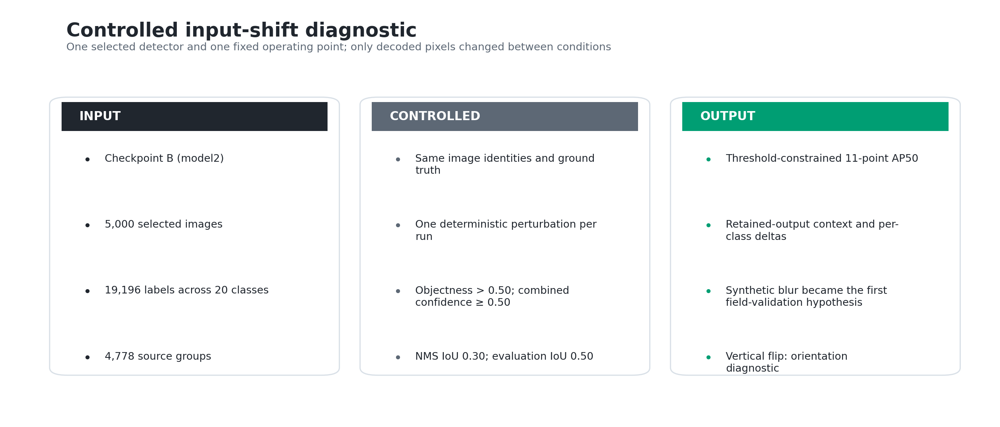
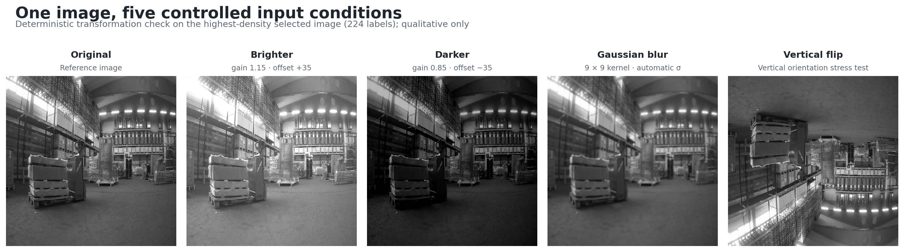
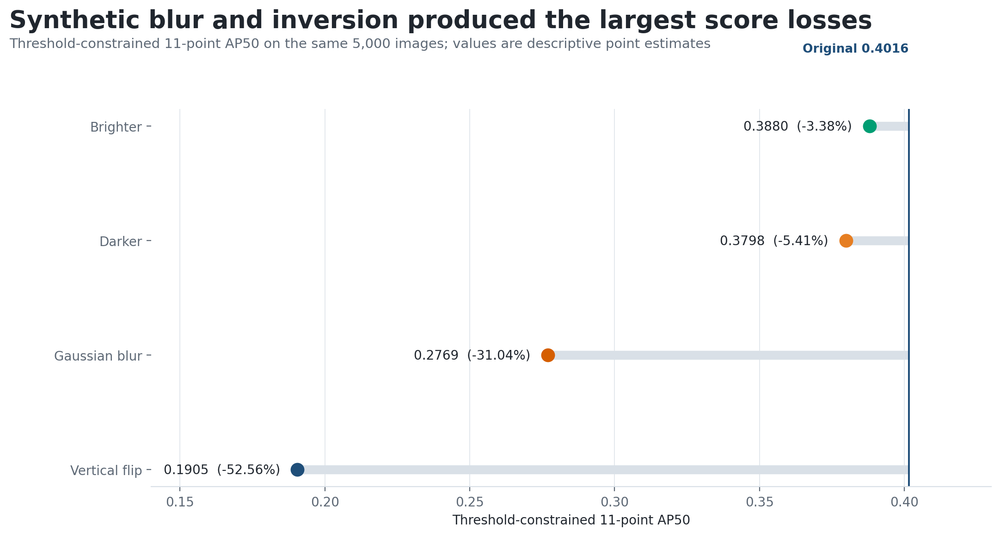
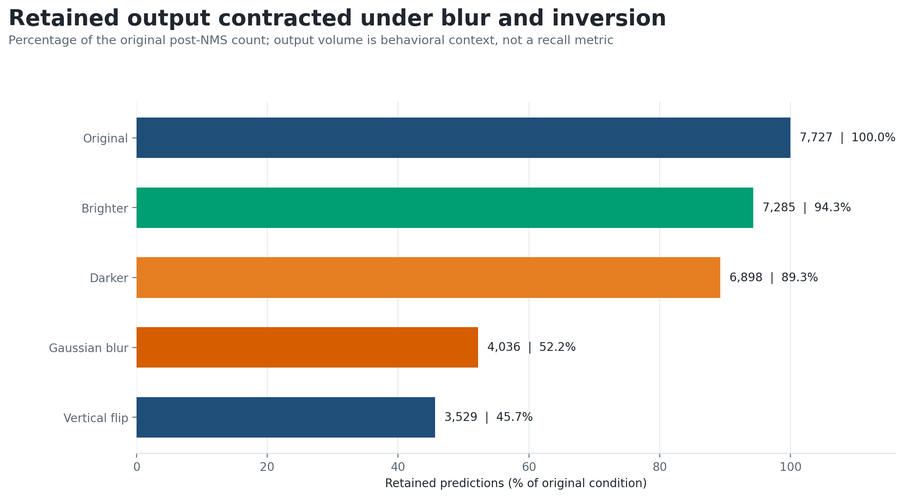
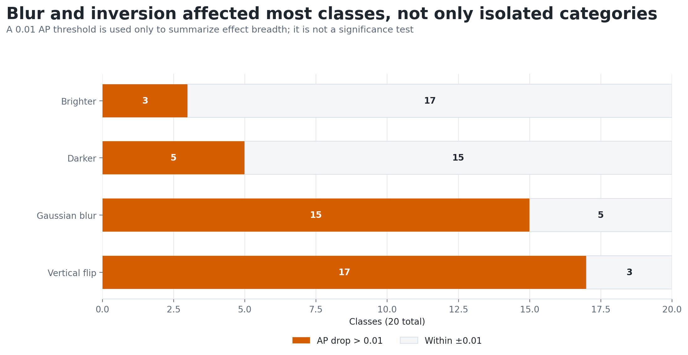
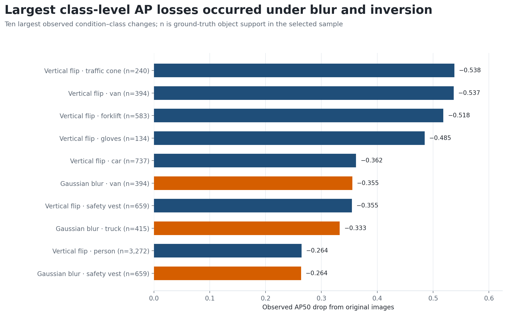

# Experiment 04 — Controlled Input-Shift Diagnostics

## Decision

This experiment measured how the selected detector responded when one input property changed while the evaluation workload and operating policy remained fixed. It was a controlled diagnostic, not a certification of production robustness.

Across the same 5,000 images, the unmodified baseline reached a macro 11-point AP50 of 0.4016. The brighter and darker conditions produced smaller observed losses of 0.0136 and 0.0217, respectively. Gaussian blur reduced the score by 0.1247, while vertical flipping reduced it by 0.2111. Those results establish three priorities:

- treat blur as the highest-priority hypothesis for a camera-derived field validation;
- retain exposure shifts as monitored validation slices rather than declare illumination invariance; and
- use vertical flip as an orientation-dependence diagnostic, not as a forecast of normal warehouse operation.

*Figure 1. The selected checkpoint and 5,000-image workload were held constant, one inference-time perturbation was applied per condition, and the response was assessed through aggregate quality, prediction retention, and class-level impact.*

**Interpretation.** The comparison isolates input condition as the intended variable. It does not isolate every source of measurement uncertainty, and the outputs are decision signals for the next validation stage rather than production guarantees.

## Why this experiment was necessary

Experiment 04 inherited decisions from the first three experiments instead of reopening them. This preserved a coherent chain from checkpoint choice to workload construction, post-processing selection, and then input-shift diagnosis.

| Prior stage | Decision carried into Experiment 04 | Why it remained fixed |
|---|---|---|
| Experiment 01 — checkpoint selection | Checkpoint B | Input sensitivity needed to be measured on the detector selected for the downstream pipeline. |
| Experiment 02 — dataset analysis and sampling | Deterministic sample of 5,000 images, 19,196 labels, and all 20 classes | Reusing the same identities made condition comparisons paired at the image level. |
| Experiment 03 — NMS thresholding | Class-aware NMS IoU threshold 0.30 | Changing suppression and pixels together would confound the diagnosis. |

*Table 1. Decisions inherited from Experiments 01–03.*

**Interpretation.** The Experiment 04 baseline is not a new configuration. Its original-image row exactly reproduces the Experiment 03 result at NMS 0.30: AP50 0.4015729433, 7,727 retained predictions, and 19,196 ground-truth objects.

## Evaluation design

Every condition used the same checkpoint, image identities, labels, confidence policy, suppression rule, and matching rule. Perturbations were applied at inference time; they did not retrain or fine-tune the detector. Ground-truth coordinates remained unchanged except for the vertical-flip condition, where each normalized box center was transformed from y to 1 − y so evaluation stayed geometrically aligned with the flipped pixels.

| Control | Fixed value |
|---|---:|
| Evaluation images | 5,000 |
| Ground-truth objects | 19,196 |
| Evaluated classes | 20 |
| Candidate objectness rule | Greater than 0.50 |
| Combined-confidence rule | At least 0.50 |
| Class-aware NMS IoU | 0.30 |
| Detection-match IoU | 0.50 |
| Quality measure | Macro 11-point interpolated AP50 |

*Table 2. Controls shared by all five input conditions.*

**Interpretation.** The reported quality score is threshold-constrained: detections below the fixed 0.50 combined-confidence threshold never enter the precision–recall calculation. It should not be read as COCO mAP or as a threshold-free characterization of the model.

The four diagnostic shifts were deliberately simple and deterministic.

| Condition | Exact transformation | Diagnostic question |
|---|---|---|
| Brighter / higher contrast | Clip(1.15 × pixel + 35) | Does a fixed exposure increase materially change the operating point? |
| Darker / lower contrast | Clip(0.85 × pixel − 35) | Does a fixed exposure decrease materially change the operating point? |
| Gaussian blur | 9 × 9 Gaussian kernel, automatic sigma | Is the detector sensitive to spatial smoothing? |
| Vertical flip | Reverse the image vertically and transform label centers | How strongly does performance depend on learned scene orientation? |

*Table 3. Inference-time perturbations and the diagnostic purpose of each.*

**Interpretation.** Each transformation represents one synthetic severity, not the full range of a real camera failure mode. In particular, Gaussian smoothing is not equivalent to measured motion blur, defocus, or video compression.

*Figure 2. One source frame under the original and four deterministic input conditions. The example is a qualitative check of transformation behavior; it is not evidence of dataset prevalence or detector quality.*

**Interpretation.** The exposure conditions preserve geometry, blur removes local spatial detail, and vertical flip changes scene orientation while preserving object content. This visual check supports the intended experimental control but does not replace the quantitative evaluation.

## Aggregate response

| Input condition | Macro 11-point AP50 | Absolute change | Relative change | Retained predictions | Retention vs. original |
|---|---:|---:|---:|---:|---:|
| Original | 0.4016 | — | — | 7,727 | 100.00% |
| Brighter / higher contrast | 0.3880 | −0.0136 | −3.38% | 7,285 | 94.28% |
| Darker / lower contrast | 0.3798 | −0.0217 | −5.41% | 6,898 | 89.27% |
| Gaussian blur | 0.2769 | −0.1247 | −31.04% | 4,036 | 52.23% |
| Vertical flip | 0.1905 | −0.2111 | −52.56% | 3,529 | 45.67% |

*Table 4. Aggregate quality and retained-prediction response under each controlled input shift.*

**Interpretation.** At the tested severities and fixed threshold, the two exposure shifts had smaller observed effects than blur or vertical flip. This ranking identifies where follow-up validation effort should begin; it does not establish statistical significance or a universal ordering across cameras and severity levels.

*Figure 3. Macro 11-point AP50 by condition, with absolute change from the original-image baseline labeled directly.*

**Interpretation.** Blur and vertical flip produce the largest quality losses. The fixed confidence rule means these changes can combine multiple effects: confidence suppression, localization degradation, class confusion, and altered detection ranking.

*Figure 4. Predictions retained after the fixed 0.50 combined-confidence filter and class-aware NMS at IoU 0.30.*

**Interpretation.** Prediction counts help explain the operating-point response, but they are not recall. A lower count may represent missed objects, duplicate removal, or fewer false positives; ground-truth matching is required to distinguish those outcomes.

## Class-level response

Aggregate AP can hide whether a shift affects a few categories or the class set broadly. For a descriptive breadth view, each class was categorized by whether its AP50 drop exceeded 0.01. This 0.01 boundary is a presentation threshold only—not a significance test or a proven materiality threshold.

*Figure 5. Number of classes with an AP50 drop greater than 0.01 versus classes remaining within ±0.01 of the original condition.*

**Interpretation.** Brighter and darker inputs crossed the descriptive loss boundary for 3 and 5 of 20 classes. Blur crossed it for 15 classes and vertical flip for 17. No condition produced an improvement greater than 0.01 for any class.

*Figure 6. The ten largest class-condition AP50 decreases, with the original-condition ground-truth support shown for context.*

**Interpretation.** Vertical flip dominates the largest losses, including traffic cone, van, forklift, gloves, and car. Blur also produces large losses for van, truck, and safety vest. Support counts provide context but do not remove uncertainty from rare classes or related frames.

## Observed response priorities

### Blur: validate first with camera-derived evidence

Gaussian blur was the most operationally plausible tested shift with a large observed effect: AP50 fell by 0.1247 and retained predictions fell to 52.23% of baseline. This does not prove that blur is the dominant field failure mode, because the test used one synthetic kernel. It does justify making blur the first field-validation hypothesis. The next test should separate measured defocus, motion blur, and codec degradation across multiple severities and camera sources.

### Exposure: monitor, but do not claim invariance

The two synthetic exposure changes produced smaller losses at the chosen settings. That supports retaining them as explicit validation slices without making them the first remediation target. It does not justify the claim that the detector is robust to warehouse illumination: glare, local shadows, sensor noise, white-balance shifts, and low-light motion effects were not reproduced.

### Vertical flip: diagnose orientation dependence

Vertical flip caused the largest measured degradation, but an inverted scene is not a normal operating condition for a fixed upright camera. The result is evidence that the detector uses orientation-dependent structure. It becomes operationally relevant only if installation, metadata, or preprocessing can invert the feed; otherwise it is a diagnostic boundary rather than a deployment forecast.

## Evidence integrity and implementation map

| Implementation reference | Responsibility |
|---|---|
| experiments/scripts/04_augmentation_robustness.py — apply_condition | Applies each deterministic inference-time transformation. |
| experiments/scripts/04_augmentation_robustness.py — parse_yolo_ground_truth | Reads YOLO labels and aligns coordinates for the vertical-flip condition. |
| experiments/scripts/04_augmentation_robustness.py — run_raw_inference and apply_fixed_nms | Produces raw predictions, then applies the frozen confidence and suppression policy. |
| experiments/scripts/04_augmentation_robustness.py — evaluate_condition | Builds the aggregate and per-class evidence tables. |
| detector_service/modules/utils/metrics.py — match_detections and calculate_map_x_point_interpolated | Performs one-to-one same-class matching and the 11-point AP calculation. |

*Table 5. Code paths connecting the experimental design to the inference and evaluation implementation.*

**Interpretation.** Transformation, label alignment, inference, fixed
post-processing, and evaluation have separate implementation responsibilities.
This keeps each input shift isolated while reusing the same matching and AP
semantics as the configured detector pipeline.

The analytical runner verifies the selected checkpoint, ordered 20-class
vocabulary, selected image identities, ground truth, and fixed NMS decision
before evaluating any shifted condition. It also requires the unmodified row to
reproduce the Experiment 03 baseline before accepting the comparison.

The selected sample contains 5,000 unique image files but only 4,778
filename-derived source groups. In the locked grouping, 197 groups contain
repeated files and the largest group contains five. Therefore, file-level
observations should not be treated as statistically independent, and the point
estimates are not presented as confidence-qualified population effects.

## Engineering decision and downstream impact

The selected checkpoint, 5,000-image workload, confidence policy, and NMS
threshold remain unchanged. Blur is promoted to the highest-priority
camera-derived validation hypothesis; brighter and darker conditions remain
explicit monitoring slices; and vertical flip remains an orientation-dependence
diagnostic rather than an expected operating condition. No perturbation result
is used to claim production robustness or to change the runtime configuration.

## Limitations

- Only one synthetic severity was tested for each condition.
- Results are deterministic point estimates without repeated trials, bootstrap intervals, or a predeclared significance analysis.
- The 5,000 files include related source groups and were also used in preceding analytical decisions; there is no untouched confirmatory set.
- The checkpoint's training-data provenance is not documented well enough to rule out overlap with this image corpus, so the evaluation is not labeled an independent generalization test.
- The fixed 0.50 confidence threshold makes the AP50 result specific to this deployment-style operating point.
- Only the selected checkpoint was tested; the experiment does not compare checkpoint-level robustness.
- Synthetic still-image shifts do not cover temporal behavior, camera-specific artifacts, streaming failures, or combinations of conditions.

These constraints bound the report's conclusion: it establishes reproducible sensitivity signals within one controlled evaluation package. It does not establish production readiness, statistical superiority, or expected field failure rates.

## Implementation and reproducibility

`experiments/scripts/04_augmentation_robustness.py` evaluates the five fixed
input conditions using the Experiment 02 workload and Experiment 03 operating
point. It validates the selected sample, applies each declared transformation,
aligns vertical-flip labels, and produces aggregate and per-class metrics under
the fixed matching policy.

Full inference requires the external dataset and model assets described in the
repository data policy. A complete reproduction must process all 5,000 images
under each of the five conditions, preserve the ordered class vocabulary, and
reproduce the Experiment 03 unmodified baseline before shifted results are
interpreted.
