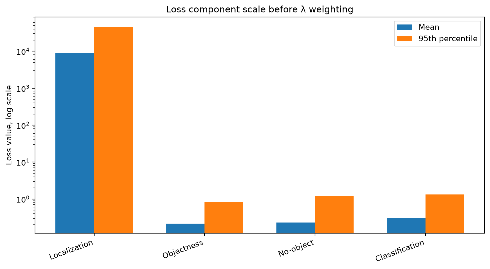
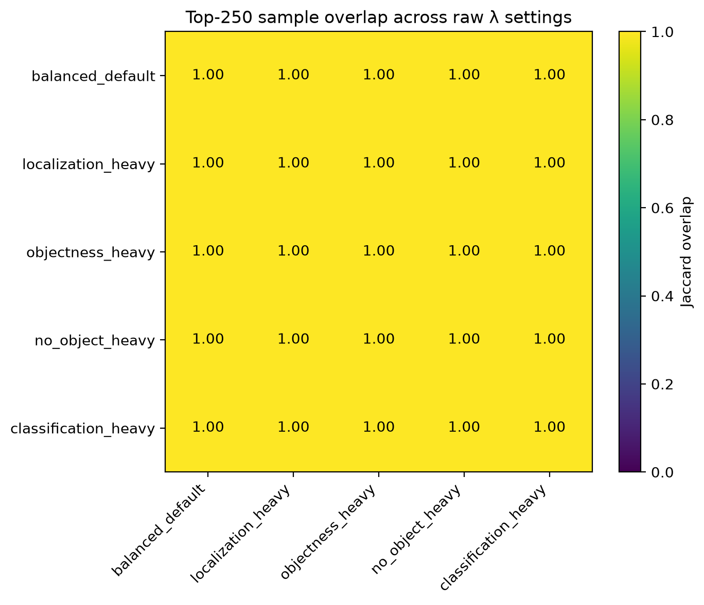
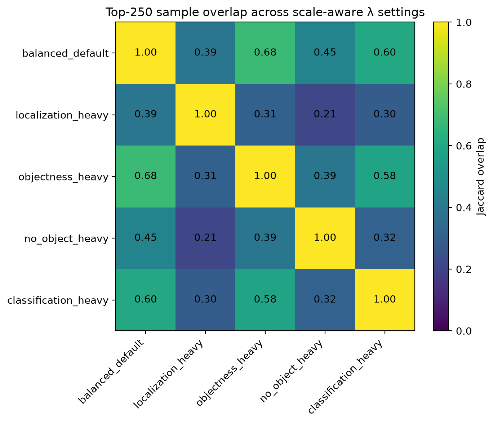
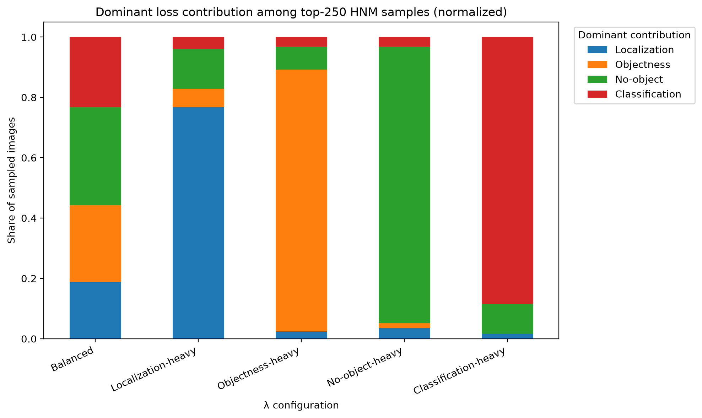
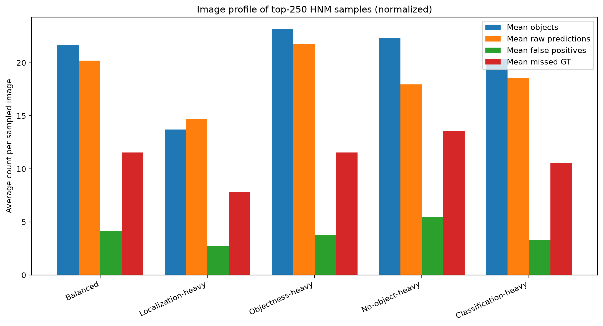
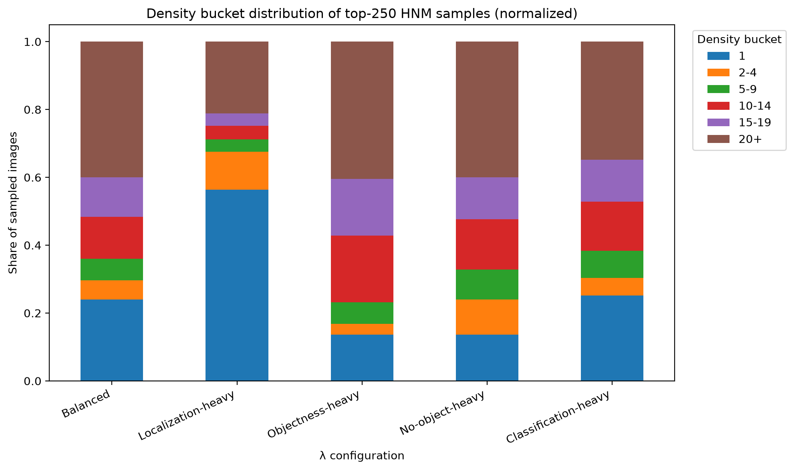
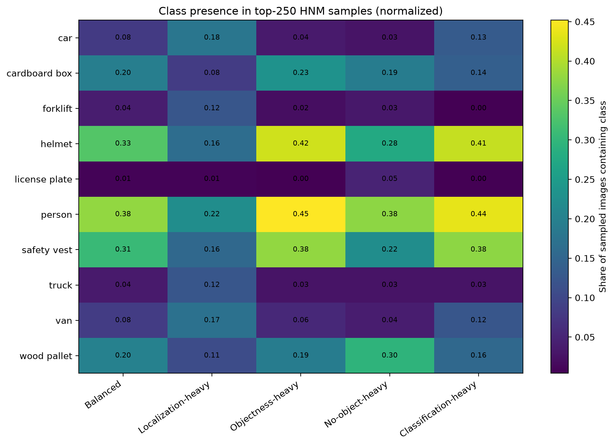

# Hard Negative Mining Analysis

### Methodology

The design question for this analysis is how different hard-negative-mining lambda values affect the types of images selected for additional training or review. In the warehouse detection pipeline, hard negative mining is controlled by a weighted loss function with four components:

* localization loss, controlled by `λ_coord`;
* objectness loss for matched detections, controlled by `λ_obj`;
* no-object loss for unmatched predictions, controlled by `λ_noobj`;
* classification loss, controlled by `λ_cls`.

The analysis uses Model 2, because it was selected as the stronger detector in model-selection analysis. It also uses the 5,000-image rare-aware density-stratified sample from dataset-sampling analysis. To keep the experiment focused on hard-negative-mining behavior rather than repeated inference variation, the analysis uses the cached raw Model 2 predictions generated during NMS-threshold analysis. These are pre-NMS predictions after the fixed score threshold of 0.5.

For each image, the analysis computes the same loss components used by the implemented `Loss.compute()` behavior. Prediction and ground-truth boxes were converted from `xywh` format to `xyxy` format before loss computation because the implemented loss function computes IoU using corner coordinates. A separate verification check compared the generated image-level components against `Loss.compute()` on representative images, including high-localization-loss, high-no-object-loss, high-class-loss, zero-prediction, and ordinary examples. The computed values matched exactly.

The experiment evaluates two versions of HNM scoring:

1. **Raw-loss HNM:** applies the lambda values directly to the raw loss components.
2. **Scale-aware HNM:** divides each component by its 95th percentile before applying the lambda values.

The scale-aware version is included because the raw loss components are not on the same numeric scale. In particular, localization loss is based on squared pixel-coordinate error, while objectness, no-object, and classification losses are confidence-based values. Without scaling, localization can dominate the total loss regardless of the other lambda values.

For each lambda configuration, the top 250 images were selected as the HNM sample. This represents 5% of the 5,000-image selected sample and is large enough to analyze the types of images each configuration prioritizes.

### Table 1: HNM Loss Component Scale Before Lambda Weighting

| Loss Component      |  Mean Loss | 95th Percentile | Interpretation                                                          |
| ------------------- | ---------: | --------------: | ----------------------------------------------------------------------- |
| Localization loss   | 8,948.5706 |     45,834.2000 | Squared pixel-coordinate error; much larger scale than other components |
| Objectness loss     |     0.2168 |          0.8404 | Confidence error on matched object predictions                          |
| No-object loss      |     0.2293 |          1.1972 | Confidence penalty for unmatched predictions / false positives          |
| Classification loss |     0.3075 |          1.3381 | Correct-class confidence error on matched predictions                   |

**Table 1: HNM loss component scale before lambda weighting.** The table shows that localization loss is several orders of magnitude larger than the other loss components before weighting.

**Interpretation and design impact.** The component-scale difference is the most important finding before evaluating lambda values. If raw loss values are used directly, localization dominates the HNM ranking because its numeric magnitude is far larger than the objectness, no-object, and classification terms. This means that simply increasing `λ_obj`, `λ_noobj`, or `λ_cls` may not change which images are selected unless the loss components are normalized or the lambda values are calibrated to account for scale.

### Figure 1: Loss Component Scale Before Lambda Weighting

**Figure 1: Loss component scale before lambda weighting.** This figure compares the mean and 95th percentile of the four HNM loss components using a log-scale y-axis.

**Interpretation and design impact.** The figure explains why raw HNM scoring is dominated by localization. Localization loss is measured in squared pixel-coordinate units, while the other terms are confidence-based losses. This makes raw lambda comparisons misleading unless the component scales are considered. For this reason, both raw-loss HNM and scale-aware HNM are evaluated.

### Table 2: Main Lambda Configurations

| Configuration        | `λ_coord` | `λ_obj` | `λ_noobj` | `λ_cls` | Intended Sampling Emphasis                               |
| -------------------- | --------: | ------: | --------: | ------: | -------------------------------------------------------- |
| Balanced             |       0.5 |     0.5 |       0.5 |     0.5 | Mixed hard examples                                      |
| Localization-heavy   |       2.0 |     0.5 |       0.5 |     0.5 | Images with poor bounding-box placement                  |
| Objectness-heavy     |       0.5 |     2.0 |       0.5 |     0.5 | Images with weak confidence on matched detections        |
| No-object-heavy      |       0.5 |     0.5 |       2.0 |     0.5 | Images with many unmatched predictions / false positives |
| Classification-heavy |       0.5 |     0.5 |       0.5 |     2.0 | Images with class-confusion errors                       |

**Table 2: Main lambda configurations for HNM analysis.** The table lists the lambda settings used to test how parameter choices affect image sampling.

**Interpretation and design impact.** Each configuration emphasizes a different failure mode. Localization-heavy sampling should prioritize images where the model detects objects but places boxes poorly. Objectness-heavy sampling should prioritize weak confidence on matched object detections. No-object-heavy sampling should prioritize false-positive-heavy images. Classification-heavy sampling should prioritize cases where the detector localizes objects but assigns weak correct-class confidence. The balanced setting is used as a mixed baseline.

### Raw-Loss HNM Result

Using raw loss values, all five main lambda configurations selected the exact same top-250 image set. The Jaccard overlap between every pair of configurations was 1.00.

This result is not a failure of the experiment. It shows an important engineering issue: when the raw loss components are not on comparable scales, lambda values may not behave as intended. In this case, localization loss dominates the total HNM score because it is much larger than the other components.

### Figure 2: Raw-Loss HNM Sample Overlap Across Lambda Settings

**Figure 2: Raw-loss HNM sample overlap across lambda settings.** This figure shows the Jaccard overlap between top-250 image sets selected by each raw-loss lambda configuration.

**Interpretation and design impact.** Every pairwise overlap is 1.00, meaning that the raw-loss lambda settings selected the same images. This confirms that the raw HNM ranking is dominated by localization loss. Under raw scoring, increasing `λ_obj`, `λ_noobj`, or `λ_cls` is not enough to meaningfully change the selected sample because localization loss remains much larger than the other components.

### Scale-Aware HNM Result

To evaluate the intended behavior of the lambda parameters, the experiment also applied scale-aware HNM. In this version, each loss component was divided by its 95th percentile before lambda weighting. This does not change the underlying loss components; it only prevents one component from dominating because of numeric scale.

After this scaling, the lambda values produced meaningfully different image samples. For example, localization-heavy and no-object-heavy sampling had a Jaccard overlap of only 0.214, meaning they selected substantially different images. Balanced and objectness-heavy sampling had higher overlap at 0.684, which is expected because the balanced configuration still includes objectness as one of its components.

### Figure 3: Scale-Aware HNM Sample Overlap Across Lambda Settings

**Figure 3: Scale-aware HNM sample overlap across lambda settings.** This figure shows the Jaccard overlap between top-250 image sets after normalizing each loss component by its 95th percentile.

**Interpretation and design impact.** Unlike the raw-loss result, the scale-aware result shows that lambda values do affect the sampled image set when component scales are controlled. Localization-heavy and no-object-heavy settings have low overlap, showing that they target different failure modes. Objectness-heavy and classification-heavy settings have moderate overlap, likely because dense PPE/person scenes can contain both weak confidence and class-confusion errors. This supports the design conclusion that lambda values are meaningful, but only if the component scales are calibrated.

### Table 3: Scale-Aware HNM Sample Profile by Lambda Configuration

| Configuration        | Mean Objects/Image | Mean Raw Predictions/Image | Mean False Positives/Image | Mean Missed GT/Image | Dominant Localization Share | Dominant Objectness Share | Dominant No-Object Share | Dominant Classification Share |
| -------------------- | -----------------: | -------------------------: | -------------------------: | -------------------: | --------------------------: | ------------------------: | -----------------------: | ----------------------------: |
| Balanced             |             21.660 |                     20.200 |                      4.164 |               11.548 |                       0.188 |                     0.256 |                    0.324 |                         0.232 |
| Localization-heavy   |             13.696 |                     14.704 |                      2.708 |                7.852 |                       0.768 |                     0.060 |                    0.132 |                         0.040 |
| Objectness-heavy     |             23.140 |                     21.800 |                      3.784 |               11.540 |                       0.024 |                     0.868 |                    0.076 |                         0.032 |
| No-object-heavy      |             22.316 |                     17.964 |                      5.504 |               13.580 |                       0.036 |                     0.016 |                    0.916 |                         0.032 |
| Classification-heavy |             20.372 |                     18.580 |                      3.332 |               10.580 |                       0.016 |                     0.000 |                    0.100 |                         0.884 |

**Table 3: Scale-aware HNM sample profile by lambda configuration.** The table summarizes the top-250 images selected by each normalized lambda configuration.

**Interpretation and design impact.** The table shows that different lambda settings select different types of images. Localization-heavy sampling has the highest dominant localization share, at 0.768, and selects fewer objects per image on average than the other targeted settings. This suggests that high localization loss can occur in relatively sparse scenes when a matched box is badly placed. Objectness-heavy sampling selects the densest prediction cases, with 23.140 objects and 21.800 raw predictions per image on average, and 86.8% of selected images are dominated by objectness contribution. No-object-heavy sampling selects the most false-positive-heavy images, with 5.504 false positives per sampled image and a 0.916 dominant no-object share. Classification-heavy sampling has the highest classification-loss contribution, with 88.4% of selected images dominated by classification loss.

### Figure 4: Dominant Loss Contribution Among Scale-Aware HNM Samples

**Figure 4: Dominant loss contribution among top-250 scale-aware HNM samples.** This figure shows which weighted loss component dominates each selected image under each lambda configuration.

**Interpretation and design impact.** This is the clearest evidence that lambda configuration changes HNM behavior. Localization-heavy sampling shifts the selected images toward localization-dominated failures. Objectness-heavy sampling shifts the selected images toward objectness-dominated failures. No-object-heavy sampling strongly emphasizes false-positive-heavy images, while classification-heavy sampling strongly emphasizes class-confusion cases. Balanced sampling produces a mixed set across all failure types.

### Figure 5: Image Profile of Scale-Aware HNM Samples

**Figure 5: Image profile of top-250 scale-aware HNM samples.** This figure compares mean object count, raw prediction count, false positive count, and missed ground-truth count across lambda settings.

**Interpretation and design impact.** The image-profile comparison shows that lambda settings change not only the loss component being emphasized, but also the scene profile of the sampled images. No-object-heavy sampling produces the highest average false-positive count. Objectness-heavy sampling selects dense scenes with many raw predictions. Classification-heavy sampling also selects relatively dense scenes, which is consistent with PPE/person scenes where visually similar classes may be confused. Localization-heavy sampling selects fewer objects on average but much higher localization-error contribution.

It is important to interpret missed ground-truth count carefully. Missed objects are measured as a diagnostic, but the implemented HNM loss does not directly penalize missed ground truth unless predictions exist. Therefore, missed-object counts describe the sampled image profile, not a separate loss term directly optimized by lambda weighting.

### Figure 6: Density Bucket Distribution of Scale-Aware HNM Samples

**Figure 6: Density bucket distribution of top-250 scale-aware HNM samples.** This figure shows how object-count density buckets differ across lambda settings.

**Interpretation and design impact.** Localization-heavy sampling favors more single-object images than the other configurations. This matches the loss-profile result: a sparse image can still become a hard example if the detected box is badly positioned. Objectness-heavy and no-object-heavy sampling shift toward denser scenes, where there are more opportunities for weak confidence, missed objects, and false positives. Balanced sampling remains mixed but still includes many dense scenes, which is appropriate for a general-purpose HNM batch.

### Figure 7: Class Presence in Scale-Aware HNM Samples

**Figure 7: Class presence in top-250 scale-aware HNM samples.** This figure shows the share of sampled images containing each class under each lambda setting. The values represent image presence, not object-count share.

**Interpretation and design impact.** The class-presence heatmap shows that lambda settings also shift the semantic composition of the HNM sample. Objectness-heavy and classification-heavy sampling emphasize PPE/person scenes, including person, helmet, and safety vest. No-object-heavy sampling includes more wood-pallet-heavy scenes, which is consistent with dense pallet images producing many unmatched predictions. Localization-heavy sampling includes relatively more vehicle-like classes such as car, van, forklift, and truck. This supports the conclusion that lambda values influence not only the numeric loss profile but also the practical image types selected for training review.

### Zero-Prediction Limitation

The implemented HNM loss is prediction-based. Images with no raw predictions receive zero localization, objectness, no-object, and classification loss, even if they contain ground-truth objects. This behavior follows the implemented loss computation, but it creates an important limitation for hard-negative mining.

In the selected 5,000-image sample, 943 images had zero raw predictions. These images still contained ground-truth objects, with a mean of 2.48 objects per image, a median of 2 objects per image, and a maximum of 15 objects in one image. None of the zero-prediction images appeared in the top-250 samples for any of the main lambda configurations.

This means the current HNM method is useful for mining images with bad predictions, false positives, weak objectness, poor localization, and class confusion. It is not sufficient by itself for false-negative mining where the model misses all objects. If the objective is to recover images where the detector produced no useful output, HNM should be paired with a separate false-negative mining strategy that explicitly samples images with ground truth but no predictions.

## Conclusion

The hard-negative-mining analysis shows that lambda values control the type of hard examples selected by HNM, but only when loss component scale is handled carefully. Using raw loss values, all main lambda settings selected the exact same top-250 image set because localization loss dominated the total score. This is an important design finding: lambda values are not meaningful by themselves if the weighted components are measured on incompatible scales.

The scale-aware analysis demonstrates the intended behavior of the lambda parameters. Increasing `λ_coord` selects images dominated by localization errors. Increasing `λ_obj` selects images with weak objectness on matched detections. Increasing `λ_noobj` selects false-positive-heavy images. Increasing `λ_cls` selects class-confusion-heavy images. Balanced weighting produces a mixed set of hard examples across failure types.

The recommended HNM strategy is therefore to use scale-aware or calibrated loss components before applying lambda weights. For a general training batch, the balanced scale-aware configuration is appropriate because it captures mixed failure modes. For targeted rectification, the lambda settings should be adjusted based on the failure mode being addressed: localization-heavy for box placement, no-object-heavy for false positives, objectness-heavy for weak detections, and classification-heavy for class confusion.

The main limitation is that the implemented HNM loss does not directly mine zero-prediction false negatives. Images with no predictions receive zero loss under the current prediction-based formulation. Therefore, HNM should be used alongside a separate false-negative mining process if the system needs to recover images where the detector fails to produce any predictions.

