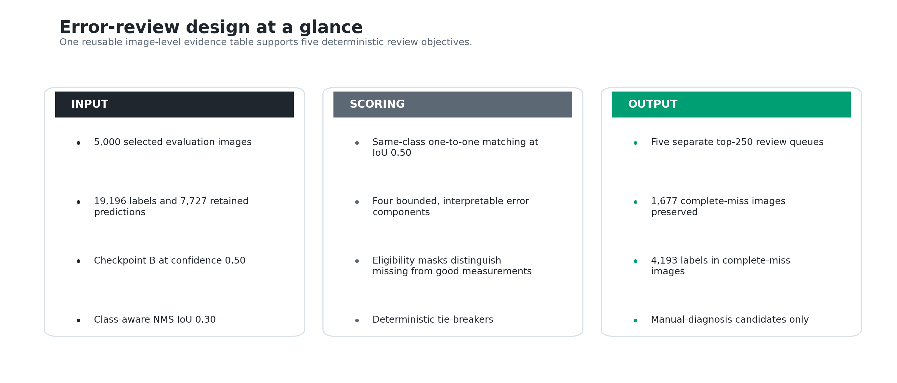
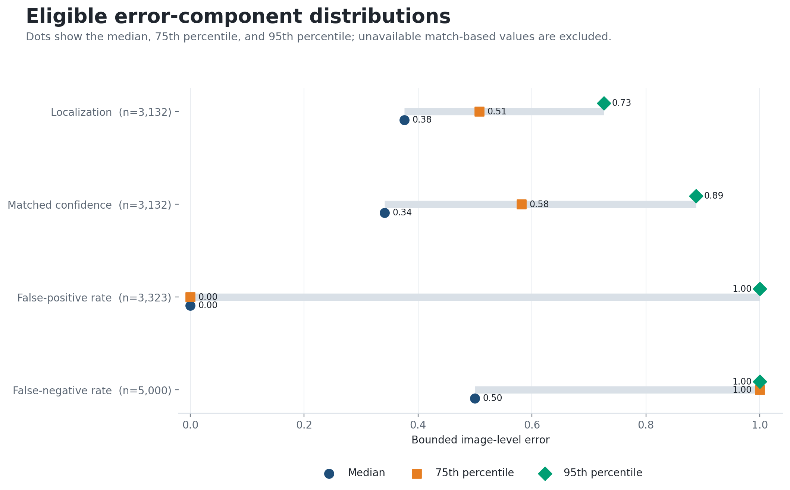
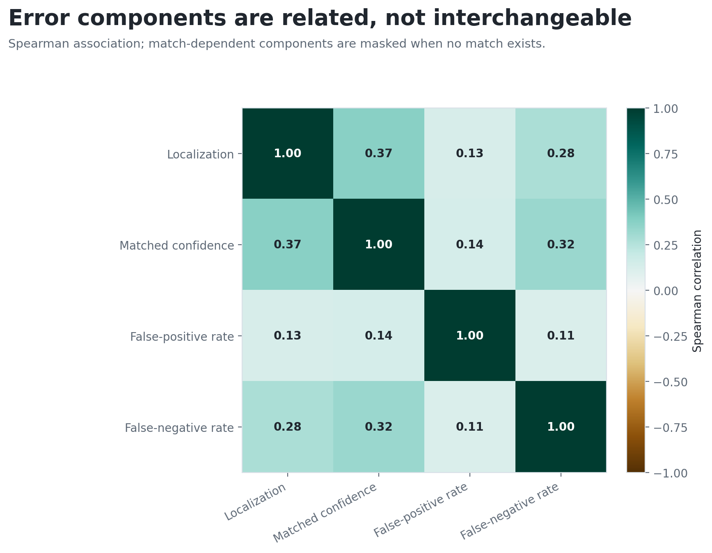
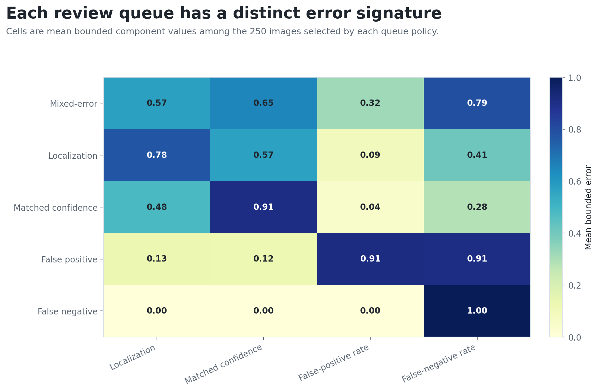
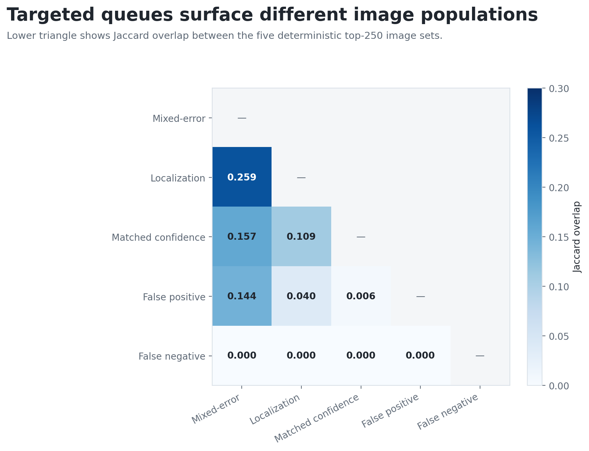
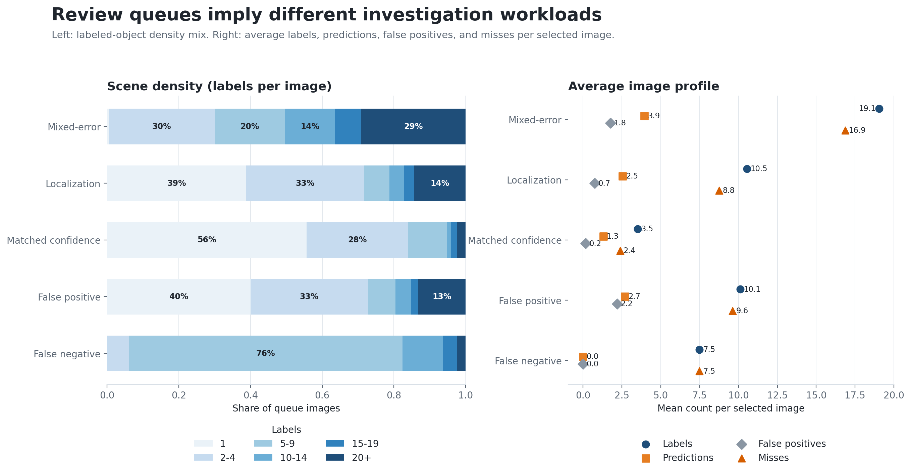
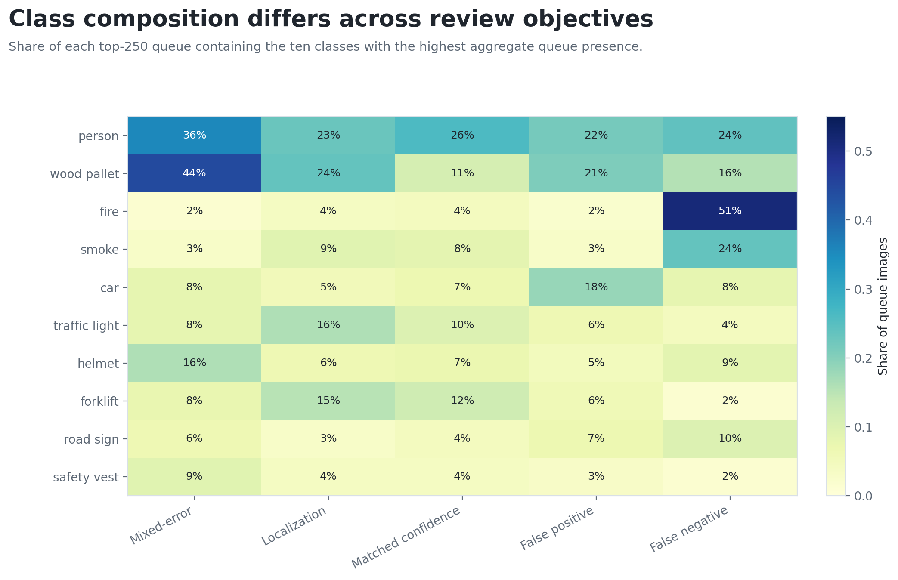

# Experiment 05 — Building Targeted Detector-Error Review Queues

## Decision

The selected detector's failures should be reviewed through **separate,
deterministic queues**, not one generic “hard image” ranking. On the fixed
5,000-image analysis workload, four image-level error components produced
five top-250 queues with materially different scene, class, and error profiles.
The largest off-diagonal Jaccard overlap was only **0.259**; the complete-miss
queue shared no images with the other four top-250 lists.

The analysis also recovered an operationally important population that a
prediction-only workflow would discard: **1,677 images had no retained
prediction despite containing 4,193 labeled objects**. Complete misses therefore
remain first-class review candidates. Queue membership is a triage signal for
human diagnosis—not evidence that an image should automatically be relabeled or
added to training.

**Figure 1. Error-review design — common evidence, controlled scoring, and separate outputs**

**Interpretation.** Every review objective starts from the same labels,
predictions, matching policy, and image-level component table. Only eligibility,
weights, and deterministic tie-breakers change, so differences between queues
reflect review intent rather than rerun-to-rerun model variation.

## Why this experiment was necessary

The preceding experiments established a stable analysis baseline. Experiment 01
selected Checkpoint B on the complete available corpus. Experiment 02 built a
bounded 5,000-image analysis workload that preserved measured class, density,
and crowding margins. Experiment 03 retained class-aware NMS IoU 0.30 as the
provisional post-processing operating point at combined confidence 0.50.
Experiment 04 then characterized controlled input-shift sensitivity.

Experiment 05 asks a different question: **given the fixed baseline predictions,
which images should an engineer inspect first for a specific failure mode?** It
does not introduce a new model-quality metric and does not rerun inference.

**Table 1. Fixed inputs and analysis controls**

| Control | Value |
|---|---:|
| Analysis workload | 5,000 indexed images |
| Ground-truth objects | 19,196 |
| Retained Checkpoint B predictions | 7,727 |
| Candidate objectness gate | Strictly greater than 0.50 |
| Retention score | Objectness × predicted-class probability, at least 0.50 |
| NMS | Class-aware, IoU 0.30 |
| Error matching | Same class, one-to-one, IoU at least 0.50 |
| Queue size | 250 images per profile |

**Interpretation.** The review queues inherit the configured runtime operating point from
Experiment 03. Their findings are conditional on that checkpoint and policy;
changing the confidence or NMS boundary can change both error components and
queue membership.

## Evaluation design

Predictions are processed in descending combined-confidence order. Each can
match at most one still-available label of the same class, and every label can be
consumed once. The resulting counts and matched values are converted into four
bounded components, all oriented so that larger values mean more severe error.

**Table 2. Error components used for ranking**

| Component | Definition | Eligible population |
|---|---|---|
| Localization | Normalized distance of mean matched IoU from 1.0 | Images with at least one match |
| Matched confidence | Normalized distance of mean matched confidence from 1.0 | Images with at least one match |
| False-positive rate | Unmatched predictions ÷ retained predictions | Images with at least one prediction |
| False-negative rate | Missed labels ÷ ground-truth labels | Images with at least one label |

**Interpretation.** A stored zero for localization or matched confidence on an
image with no match means “not measurable,” not “excellent.” Explicit eligibility
masks keep missing measurements from entering matched-value summaries or
specialist rankings.

## Population-level error behavior

**Table 3. Eligible component distributions**

| Component | Eligible images | Mean | Median | 75th percentile | 95th percentile |
|---|---:|---:|---:|---:|---:|
| Localization | 3,132 | 0.3973 | 0.3760 | 0.5078 | 0.7261 |
| Matched confidence | 3,132 | 0.3742 | 0.3412 | 0.5815 | 0.8879 |
| False-positive rate | 3,323 | 0.0936 | 0.0000 | 0.0000 | 1.0000 |
| False-negative rate | 5,000 | 0.5103 | 0.5000 | 1.0000 | 1.0000 |

**Interpretation.** Match-dependent errors vary gradually, while the rate
components have substantial mass at their boundaries. Many false-positive and
false-negative rows therefore tie at zero or one, making count-based and filename
tie-breakers necessary for stable rankings.

**Figure 2. Eligible error-component distributions**

**Interpretation.** The continuous matched-value distributions and boundary-heavy
rate distributions have different shapes. A single mean or undifferentiated
severity score would conceal those differences.

**Figure 3. Spearman association between error components**

**Interpretation.** The strongest off-diagonal association is 0.373 between
localization and matched-confidence error. False-positive and false-negative
rates remain only weakly associated with those matched-value components. These
relationships support retaining a vector of errors rather than treating the
four measures as interchangeable.

## Review policies and deterministic ranking

The mixed-error score equally weights all four components. Each specialist score
activates one component only. Before sorting, rows are filtered to the population
where the target measurement is meaningful; ties then use relevant raw counts
and finally ascending filename.

**Table 4. Queue policies**

| Queue | Eligibility | Active components | Primary count tie-breaker |
|---|---|---|---|
| Mixed-error | All images | All four, equal weight | Missed labels, then false positives |
| Localization | At least one match | Localization | Matched predictions |
| Matched confidence | At least one match | Matched confidence | Matched predictions |
| False positive | At least one prediction | False-positive rate | False-positive predictions |
| False negative | At least one label | False-negative rate | Zero-prediction flag, then missed labels |

**Interpretation.** The weights express investigation intent, not learned
parameters or business cost. Stable sorting and a final filename tie-breaker make
the top-250 lists reproducible for identical inputs.

## Queue separation and workload profiles

**Table 5. Mean profile of each top-250 queue**

| Queue | Mean profile score | Labels | Predictions | False positives | Missed labels | Zero-prediction images |
|---|---:|---:|---:|---:|---:|---:|
| Mixed-error | 0.5830 | 19.052 | 3.948 | 1.772 | 16.876 | 0 |
| Localization | 0.7767 | 10.548 | 2.540 | 0.748 | 8.756 | 0 |
| Matched confidence | 0.9092 | 3.516 | 1.304 | 0.172 | 2.384 | 0 |
| False positive | 0.9126 | 10.120 | 2.692 | 2.200 | 9.628 | 0 |
| False negative | 1.0000 | 7.492 | 0.000 | 0.000 | 7.492 | 250 |

**Interpretation.** Scores are comparable only within a policy because each
queue uses different weights and eligibility. The raw count profiles clarify the
review workload: mixed-error images are label-dense, false-positive images emit
mostly unmatched detections, and every selected false-negative image is a
complete miss.

**Figure 4. Mean error signature by review queue**

**Interpretation.** Each specialist queue peaks on its intended component. The
mixed-error list remains elevated across localization, confidence, and
false-negative behavior, confirming that it captures compound cases rather than
replicating one specialist ranking.

**Figure 5. Pairwise Jaccard overlap of top-250 image identities**

**Interpretation.** Mixed-error and localization have the largest overlap:
103 shared images, or Jaccard 0.259. Mixed-error overlap is 0.157 with matched
confidence and 0.144 with false positive. The complete-miss queue has zero
observed overlap with every other top-250 list. The policies therefore surface
meaningfully different populations.

**Figure 6. Scene-density mix and average investigation workload**

**Interpretation.** Mixed-error review is dominated by dense scenes: 29.2% of
its images contain at least 20 labels. The matched-confidence queue is mostly
sparse, while 76.4% of complete-miss images contain five to nine labels. Silent
failure is therefore not confined to trivial scenes.

## Class patterns and review priorities

**Figure 7. Class presence across review objectives**

**Interpretation.** Fire appears in 51.2% of complete-miss images and smoke in
23.6%; mixed-error scenes are led by wood pallet (44.4%) and person (35.6%); the
false-positive queue contains car in 18.4% of its images. These are triage
patterns, not per-class AP estimates: one image can contain several classes, and
enrichment may reflect both corpus composition and detector behavior.

The operational follow-up is consequently split by objective:

- manually inspect complete-miss fire and smoke cases for annotation, visibility,
  threshold, and domain issues;
- use dense mixed-error scenes as integration stress cases;
- inspect localization and matched-confidence lists separately before proposing
  calibration or box-quality changes; and
- review false-positive backgrounds before collecting or relabeling negatives.

## Evidence integrity and implementation map

**Table 6. Implementation map**

| Responsibility | Code path | Main symbol |
|---|---|---|
| Same-class matching and bounded components | `detector_service/modules/rectification/hard_negative_mining.py` | `compute_image_error_components` |
| Weighted component scoring | same module | `score_error_components` |
| Verified upstream decisions and one row per selected image | `experiments/scripts/05_build_hnm_components.py` | `resolve_prediction_input`, `build_component_table` |
| Eligibility, ranking, and queue summaries | `experiments/scripts/05_build_error_review_queues.py` | `build_top_samples`, `build_artifacts` |

**Interpretation.** Component construction is separated from review policy.
The component builder resolves the post-NMS input from the verified checkpoint
and NMS operating-point decisions by default, then enforces matching model,
threshold, dataset, and condition provenance. Queues can be rescored from the
validated component table without rerunning detector inference.

The evidence contract separates reusable image-level components, queue-policy
definitions, ranked review sets, and aggregate summaries. Validation reconciles
all 5,000 component rows, five 250-image queues, rank continuity, overlap
symmetry, density totals, and class-share bounds before the results are accepted.

## Engineering decision and downstream impact

The project retains five review queues and the underlying four-component table.
Complete misses remain visible in future analysis, and no queue is treated as an
automatic retraining set. The queues must be regenerated when the checkpoint,
  candidate gate, confidence threshold, NMS threshold, matching policy, source
  workload, or queue definition changes.

## Limitations

- The 5,000-image workload is a deterministic analysis set, not an untouched
  confirmation set; checkpoint training overlap is unknown.
- Images are not statistically independent: source-family duplicates and shared
  acquisition context can remain.
- Queue size 250, equal mixed-error weights, and specialist weights are
  engineering choices, not optimized business-cost functions.
- Correlation and class enrichment are descriptive. They do not identify causal
  failure mechanisms or statistical significance.
- A complete miss can result from model weakness, thresholding, annotation error,
  image ambiguity, or domain shift; manual inspection is required.
- Queue findings are conditional on the current checkpoint, thresholds,
  matching rule, queue size, and weighting policy. They must be recomputed when
  any of those controls changes.

## Implementation and reproducibility

`experiments/scripts/05_build_hnm_components.py` derives the four image-level
error components from the selected sample, verified checkpoint and NMS policy,
ground truth, and retained predictions. By default, it resolves the prediction
artifact from those upstream decisions; any explicit override must carry the
same `model` and `nms_threshold` provenance.

`experiments/scripts/05_build_error_review_queues.py` applies the five declared
review policies and produces their ranked tables. Reproduction requires the
same 5,000-image workload, retained predictions, ordered class vocabulary,
matching policy, component definitions, queue size, and deterministic
tie-breakers. The analysis validates population totals, count identities,
queue sizes and ranks, overlap symmetry, density totals, and class-share bounds.
